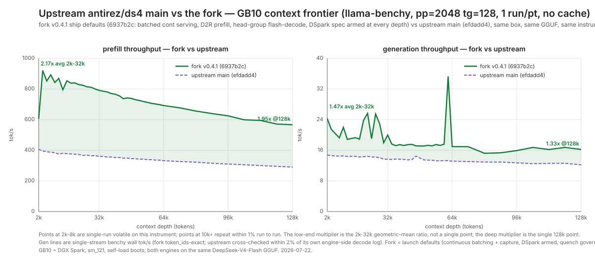
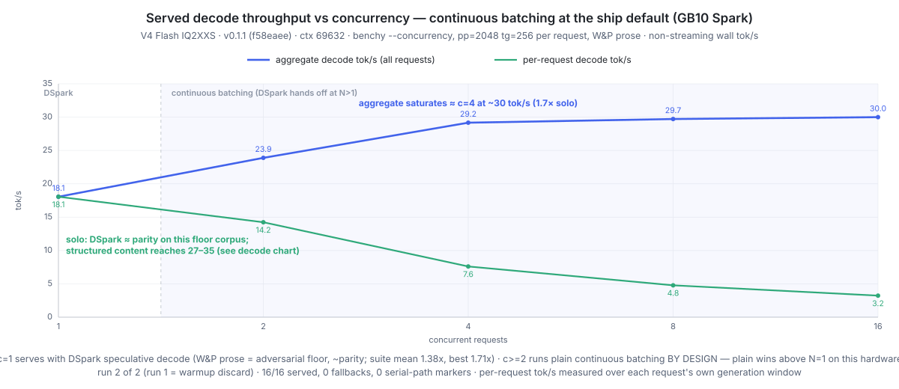

# ds4-on-spark

This repo gets **[`Entrpi/ds4`](https://github.com/Entrpi/ds4)** — our
DGX-Spark-optimized, major-feature fork of
[`antirez/ds4`](https://github.com/antirez/ds4) (DwarfStar 4) — running on
your Spark with one command, serving **DeepSeek-V4-Flash** entirely on-device
(GB10 / SM121, 128 GB unified memory — ~119 GiB usable; RTX PRO 6000 /
5090-class `sm_120` also builds).

Compared to the upstream engine you get **double the prefill throughput**
(2.2× on GB10 vs current upstream main, 2026-07-21; ~4× on a PRO 6000 at
the v0.1.0 stamp), **1.33–1.47× the decode speed across the full 2k–128k
context range**, and a rich serving experience
upstream doesn't have: **continuous batching**, **prefix caching** (warm
start cuts time-to-first-token ~7× on shared prefixes, with fork-by-copy
fan-out for parallel branches), and **DSpark lossless speculative decode** —
together, a much faster multi-agent experience than single-stream serving.
The [fork delta table](#what-the-fork-adds-over-upstream) itemizes exactly
what changed and how each claim was measured; benchmarks, the roofline
model, and the engineering story follow below. Upstream remains the
architectural foundation and the model recipe — this repo pins and packages
the fork.

**Prefill and decode vs upstream, across the context frontier** (upstream
`main` at `efdadd4`, measured 2026-07-21/22 on the same box, same GGUF and
instrument as the fork's v0.4.1 line; the fork line is the launch-default
ship config this installer boots):



**Decode at the ship config** (DSpark + yield-quench; since v0.4.0 there is
no kv-depth gate — speculation is armed at every depth and the quench
controller governs) — solid green is the adversarial-prose floor test,
dashed orange is code continuation; the fork's ship decode runs 1.47× the
upstream engine on the low band and 1.33× at 128k. Its own-plain floor is
the quench controller's bounded learning debt on short generations:
typically 0.95–0.97× on adversarial prose (band geomean 1.04×), with
post-quench serving measured identical to plain (forced-quench identity
1.000–1.004; see the fork CHANGELOG v0.4.1 for the measured mechanism):


**Status:** Working end-to-end, pinned to the fork release
[**`v0.4.1`**](https://github.com/Entrpi/ds4/blob/v0.4.1/CHANGELOG.md) — the
deep-decode substrate line plus the quench recalibration: head-group
flash-decode for dense and indexed attention, aligned dense tiers at every
verify width, speculation armed at every depth (the static 64k kv-depth
gate is gone; the yield-quench controller is the only governor), and the
quench break-even guard recalibrated to v0.4's measured verify cost
(v0.4.1: the v0.1.1-era guard was terminally quenching winners; code-corpus
band 1.10× vs plain, adversarial prose 1.04×). Deep serving decode dropped
27–35 % release-over-release at v0.4.0 and holds at v0.4.1 (240K-context
conversations decode at 57.3 ms/tok, 515K at 59.9, 12K at 36.6 —
fresh-boot turn-2 stamps quoted with their speculative tok/step in the
fork changelog), the 762K-token deep-context charter passes, and the full
quality restamp is band-exact against the prior release (needles 70/70,
zero eval errors; v0.4.1 is a controller-constant change with all-zero
tensor deltas). Since v0.2.2 the engine builds its aligned fast-path
weight artifacts in-process at boot, so **installer setups get the same
decode/prefill tier as weight-server setups out of the box** (the active
tier shows in the boot log and `/v1/stats`). Speculative gain is
content-dependent (structured / code / math wins; adversarial prose sits
at 1.04× geomean behind the quench governor, typical floor 0.95–0.97× —
bounded learning debt, see the fork CHANGELOG v0.4.1) — see the
[two-corpus frontier chart](docs/v041_decode_overlay.svg) and the
[break-even law](#the-break-even-law) below. The v0.1.1 uplift-suite stamp
(suite mean ~28 t/s, 1.38× the plain decode of that era, peak 1.71× on
stepwise math) predates v0.4.0's much faster plain baseline. Prefill runs
~2.2× the upstream engine on GB10 (D2R tensor-core MoE GEMMs, measured
against upstream main 2026-07-21). The Metal backend is unaffected.

- **Reference:** [`antirez/ds4`](https://github.com/antirez/ds4) — MIT-licensed C+CUDA inference engine (CUDA backend landed 2026-05-11). **This repo pins the [`Entrpi/ds4`](https://github.com/Entrpi/ds4) fork at release [`v0.4.1`](https://github.com/Entrpi/ds4/blob/v0.4.1/CHANGELOG.md)** (2026-07-22): the deep-decode substrate line — everything through v0.2's robust serving (continuous batching, crash fixes, tools/thinking speculation on the continuous path, deep-context capacity, FP8/FP4 packed compressed-KV as the default primaries, observability), v0.3's tensor-core batched scorer and durable pinned banks (deep conversations survive eviction and restarts), v0.4's head-group flash-decode for dense and indexed attention, aligned dense verify tiers, MoE gate_up expert dedup, speculation armed at every depth (quench governing, no kv-depth gate) plus a community-contributed reap of queued requests whose client disconnected, and v0.4.1's quench recalibration (the break-even guard now tracks v0.4's measured verify cost). The fork `CHANGELOG.md` documents every fork-side change.
- **Model:** [`antirez/deepseek-v4-gguf`](https://huggingface.co/antirez/deepseek-v4-gguf) — 81 GiB asymmetric quant: IQ2_XXS for routed-expert gate/up, Q2_K for routed-expert down (these dominate model bytes), Q8_0 for everything else dense (shared expert, attention projections, output head, router), F16 for LoRA matrices and the compressor/indexer, F32 norms. (FP8 in ds4 is a *runtime* KV-cache quantization — E4M3FN round-trip — not a stored weight format.) Plus an optional 3.6 GiB MTP draft GGUF.
- **Hardware:** NVIDIA DGX Spark, GB10, SM121, 128 GB LPDDR5X unified (~119 GiB usable). The donor's `Makefile` has a `make cuda-spark` target that builds native `sm_121`, plus `make cuda CUDA_ARCH=sm_NNN` for an explicit override — both GB10-correct with no patches needed. (Building with an empty `-arch` measured ~25% slower prefill on GB10, so the explicit arch matters.)

## What the fork adds over upstream

[`Entrpi/ds4`](https://github.com/Entrpi/ds4) tracks upstream and specializes
it for **Blackwell CUDA serving performance**. Everything below is fork-side
work, measured engine-to-engine against upstream `main` on the same GB10, same
GGUF (upstream decode measured flat May → July 2026):

| Area | Fork | vs upstream |
|---|---|---|
| **Prefill** | D2R ("dequant-to-register") tensor-core MoE GEMMs — IQ2_XXS / Q2_K / Q8_0 expert weights dequantized directly into MMA fragments from aligned SoA artifacts; token-tile HMMA attention; L2-reuse-aware expert-major CTA schedule | **2.17× on GB10** (2k–32k geomean vs main `efdadd4`, 1.95× @128k; 305 → 800 tok/s @12k over the fork's own arc; ~4× on RTX PRO 6000 at the v0.1.0 stamp) |
| **Decode** | Per-layer CUDA-graph capture; head-group flash-decode for dense and indexed attention (v0.4.0); aligned-quant dispatch tiers at every verify width | **1.33–1.47× across 2k–128k context** at the ship config ([chart](docs/v041_upstream_overlay.svg)) |
| **Speculation** | DSpark lossless block drafter (3-layer target-fused, Q2K) + terminal yield-quench (net-positive per request, default on); armed at every depth since v0.4.0 — no kv-depth gate; break-even guard recalibrated to v0.4 verify cost in v0.4.1 | upstream MTP is single-token, net-negative single-stream; fork code-corpus band **1.10×** its own plain decode, adversarial prose 1.04× (typical quench floor 0.95–0.97×, bounded learning debt); the vs-upstream win is the headline |
| **Serving** | Continuous batching (mid-flight admit/evict, chunked prefill interleave), per-bank warm start (~7× TTFT on shared prefixes), fork-by-copy fanout, OpenAI + Anthropic-shape APIs | upstream serves one stream |
| **Ops** | Resident weight server (VMM-backed, IPC manifest) — engines import the 81 GiB model in seconds instead of multi-minute reloads; builds the aligned repack artifacts the fast kernels read in place | upstream reloads per process |
| **Telemetry** | Per-step speculative trace + offline policy replayer (`tools/dspark_trace_replay.py`), quench/gate/profile counters | — |

Every fork-side change is documented in the fork
[`CHANGELOG.md`](https://github.com/Entrpi/ds4/blob/v0.4.1/CHANGELOG.md);
the [roofline analysis](#roofline-why-speculation-and-batching-are-the-levers)
below explains why these are the changes that matter on this hardware.

## Quick start

On a DGX Spark with CUDA 13 installed:

```bash
curl -sSL https://raw.githubusercontent.com/entrpi/ds4-on-spark/main/install.sh | bash -s -- --start
```

That one command:

1. Verifies the host (aarch64, GB10/SM121, CUDA 13, ≥120 GiB free disk).
2. Clones the `Entrpi/ds4` fork at tag **`v0.4.1`** into `~/code/ds4` (or `$DS4_SRC_DIR`).
3. Builds `ds4`, `ds4-server`, `ds4-bench` with `CUDA_ARCH=sm_121` in ~8 s.
4. Downloads the Q2 GGUF (~81 GiB) + MTP GGUF (~3.6 GiB) from
   [`antirez/deepseek-v4-gguf`](https://huggingface.co/antirez/deepseek-v4-gguf)
   and the DSpark Q2K drafter (~6.5 GiB) from
   [`bleysg/DeepSeek-V4-Flash-DSpark-drafter-GGUF`](https://huggingface.co/bleysg/DeepSeek-V4-Flash-DSpark-drafter-GGUF)
   into `~/gguf` (or `$DS4_GGUF_DIR`).
5. Runs the "capital of France" smoke test and asserts "Paris" in the output.
6. Installs the **`ds4-serve`** launcher to `~/.local/bin`.
7. Starts `ds4-server` on `:8000` with `-c 32768` serving the **full DSpark
   speculative stack** — lossless, suite mean **1.38× plain decode**, with the
   yield-quench controller riding the v0.4.1 defaults (speculation armed at every depth; no kv-depth gate; guard recalibrated to v0.4 verify cost).

`--no-dspark` serves plain continuous decode instead (skips the drafter
download); `--with-mtp` alone gives MTP-2 speculation (a modest ~1.08×).

### Serving after install: `ds4-serve`

The full-stack launch is one command; every optimization is default-on and
you only pass what you want to change:

```bash
ds4-serve                              # full stack, ctx 32768, 127.0.0.1:8000
ds4-serve -c 69632                     # more context (multi-agent harnesses)
ds4-serve -c 69632 --host 0.0.0.0      # reachable from other machines
```

Anything you pass goes straight to `ds4-server` and overrides the defaults
(`ds4-server --help` lists everything, `--cors` included). `--no-dspark`
downgrades to MTP-2 speculation, `--no-spec` to plain decode. Sizing `-c`:
the context budget is shared by concurrent sequences (KV ≈9.5 KiB/token), so
bigger `-c` means fewer parallel requests fit before new ones queue. It runs
in the foreground; supervise with nohup/systemd/tmux as you prefer.

As of the v0.2.3 pin the engine itself has the same launch defaults: on this
install layout a bare `ds4-server -c 49152 --host 0.0.0.0` boots the full
stack too (one boot line reports what was auto-enabled). `ds4-serve` remains
a thin convenience over it.

To preview without running:

```bash
curl -sSL https://raw.githubusercontent.com/entrpi/ds4-on-spark/main/install.sh | bash -s -- --help
```

Common overrides: `--cuda-arch sm_120` (RTX PRO 6000 / 5090-class Blackwell; datacenter B200/B300 is `sm_100`, untested), `--no-download`
(reuse existing GGUF), `--src-dir`, `--gguf-dir`, `--ctx`, `--port`, `--force`
(skip host check).

## Upgrading from an earlier install

Re-run the installer — every step is idempotent:

```bash
pkill -x ds4-server   # the installer starts servers but never stops old ones
curl -sSL https://raw.githubusercontent.com/entrpi/ds4-on-spark/main/install.sh | bash -s -- --start
```

What happens to an existing setup:

- **Your ds4 clone fast-forwards to the `v0.4.1` tag** (`git fetch` +
  `reset --hard`, remote repointed automatically if you installed back when
  this repo cloned `antirez/ds4`). Any local edits in that clone are
  **discarded** — it's an installer-managed tree.
- **GGUFs you already have are kept** (size-checked, not re-downloaded). Two
  new downloads happen on upgrade: the DSpark drafter (~6.5 GiB) and — if you
  installed before 2026-07-13 — the **imatrix base quant** (~81 GiB): the old
  installer default pointed at the plain `chat-v2.gguf` while the quality
  baselines were all measured on `chat-v2-imatrix.gguf`; the default now
  matches the validated build. To keep serving your existing non-imatrix
  file instead (and skip the 81 GiB):
  `GGUF_FILE=DeepSeek-V4-Flash-IQ2XXS-w2Q2K-AProjQ8-SExpQ8-OutQ8-chat-v2.gguf ./install.sh --start`
- **The default serve mode changes** from plain decode to the DSpark
  speculative stack (same OpenAI-compatible API, lossless output, ~10 GiB
  more unified memory in use). `--no-dspark` restores the old behaviour.
- If a rebuild ever looks wrong after a big jump, `make -C ~/code/ds4 clean`
  and re-run.

## Hardware requirements

| | |
|---|---|
| Validated on | NVIDIA DGX Spark (GB10, SM121, 128 GB / ~119 GiB unified) |
| Likely to work | RTX PRO 6000 / 5090-class Blackwell with `--cuda-arch sm_120` (PRO 6000 prefill measured); `sm_100` datacenter untested |
| CUDA toolkit | 13.x (we tested 13.0.88) |
| Disk | ≥110 GiB free for the GGUFs |
| OS | aarch64 Linux (Grace) |
| RAM (system, unified) | 128 GB (~119 GiB usable) is enough for the model + ~250 MB KV @ 16k context |

GB10 is detected via `nvidia-smi --query-gpu=compute_cap` returning `12.1`.
Anything else gets a warning + `--force` override path.

## What you get

| Binary | Purpose |
|---|---|
| `ds4` | Interactive / one-shot CLI |
| `ds4-server` | OpenAI v1-compatible HTTP server (`POST /v1/chat/completions`, SSE streaming) |
| `ds4-bench` | Direct prefill + decode throughput sweep (no HTTP) |

`ds4-server` is the recommended runtime. It exposes:

- `POST /v1/chat/completions` (OpenAI-compatible streaming, tool calls)
- `POST /v1/completions`
- `GET /v1/models`

It also speaks Anthropic-shape on `/v1/messages` (see donor README).

## DSpark: the featured serving mode

Since fork `v0.1.1`, the featured runtime is **continuous batching + DSpark
lossless speculative decode** (a DFlash-style drafter verified by the target
model — the verify forward is the sole token source, so output is lossless by
construction; quality held at gsm8k 97.5 % / mbpp 92.5 % through the full
serving path at the release gate).

Measured on GB10 with llama-benchy's `mtp-bench` suite (9 workloads × 3 runs,
512 tokens, non-streaming wall tok/s):

| workload | plain t/s | DSpark t/s | gain | tok/step | accept |
|---|---|---|---|---|---|
| stepwise_math | 20.1 | 34.5 | **1.71×** | 4.00 | 89 % |
| qa_factual | 19.6 | 31.9 | 1.63× | 3.89 | 91 % |
| summarize | 19.6 | 31.0 | 1.59× | 3.88 | 87 % |
| code_cpp | 20.4 | 30.0 | 1.47× | 3.38 | 80 % |
| translation | 20.4 | 27.9 | 1.37× | 3.10 | 76 % |
| code_python | 20.5 | 26.4 | 1.29× | 2.94 | 72 % |
| explain_concept | 20.5 | 25.2 | 1.23× | 2.80 | 69 % |
| long_code_review | 18.8 | 22.1 | 1.17× | 2.62 | 66 % |
| creative_short | 20.6 | 19.9 | 0.96× | 2.18 | 58 % |
| **suite mean** | **20.1** | **27.7** | **1.38×** | — | — |

<sub>Stamped 2026-07-11 at the v0.1.0 release cut (Q4K drafter, `-c 4096`,
non-streaming `usage`-counted wall tok/s). The Q2K drafter — the v0.1.1
default — measured equal-or-better in a same-script A/B (suite mean 28.8 vs
28.3, acceptance within ±3 pp per workload).</sub>


The chart is the honest version of the same story across context depth,
re-measured at v0.4.1 (2026-07-22): the solid green line is **War & Peace
continuation** — deliberately the hardest corpus, at or just under
break-even — and the dashed orange line is **C-source continuation**
(1.10× plain on average at this shape). The vs-plain margins are thinner
than the v0.1.1 chart showed because v0.4.0's plain baseline absorbed the
arc's decode gains (plain itself is 9–26 % faster than v0.1.1's plain,
growing with depth); the purple reference line is upstream main, measured
2026-07-21 on the same box and instrument. Content decides the win; the
safety nets bound the losses:

- a **terminal yield-quench controller** (default on) that turns speculation
  off for the rest of any request whose realized acceptance can't pay its
  verify cost. Its worst case is a bounded learning cost — a few
  speculative steps of evidence before the quench fires — landing short
  adversarial generations at 0.95–0.97× plain on typical draws (chart
  worst point 0.95×; post-quench serving measures identical to plain,
  forced-quench identity 1.000–1.004), versus 0.72× for always-on
  speculation on the same corpus;
- since v0.4.0 the quench controller is the *only* governor: the static
  kv-depth gate is gone and speculation stays armed at every depth (v0.4's
  flash-decode rewrites cut the width-5 verify cost that motivated the
  gate). Setting `DS4_DSPARK_MAX_KV=N` restores a hard depth cap if you
  want one.

### The break-even law

One DSpark verify step (1 committed row + 4 draft rows through the full
model) costs **2.03–2.08 plain decode steps** on GB10 across the 2k–64k
band (measured at v0.4.1; it rises to ~2.4 at 240K–515K depth). So

```
speedup = tokens-per-step ÷ ~2.05       break-even ≈ 51 % draft acceptance
```

Everything above follows from this: structured content accepts 70–90 % of
drafts (1.3–1.7×), open-ended prose sits near break-even, and the quench
controller is just this law enforced per request — it accumulates the
cumulative regret `guard − tokens-per-step` each verify step and terminally
quenches the request when the deficit exceeds ~4 plain-step times. The
guard sits AT the measured break-even (v0.4.1: **2.10**, recalibrated from
the v0.1.1-era 2.22 — v0.4's flash-decode rewrites cut the verify cost, and
the stale guard was terminally quenching winners). The parameters are
calibrated offline against per-step traces (`DS4_DSPARK_TRACE=1` +
`tools/dspark_trace_replay.py` in the fork) and the in-engine controller is
validated to reproduce the offline policy exactly.

### The drafter artifact

The installer downloads the prebuilt ~6.5 GiB Q2K drafter from
[`bleysg/DeepSeek-V4-Flash-DSpark-drafter-GGUF`](https://huggingface.co/bleysg/DeepSeek-V4-Flash-DSpark-drafter-GGUF)
by default. Q2K routed experts are the ship default (equal throughput and
acceptance to Q4K in A/B, 4.2 GiB smaller). To build a drafter yourself from
the official checkpoint's drafter shards (e.g. the Q4K-expert variant), use
the fork's extraction tool:

```bash
cd ~/code/ds4
python3 gguf-tools/dspark_extract.py --src <dir-with-drafter-shards> \
    --out ~/gguf/DSpark-drafter-Q4K-Q8.gguf --validate --experts q4_k
```

Kill switches if you ever need them: `DS4_DSPARK_QUENCH=0` (always-spec, no
quench), `DS4_DSPARK_MAX_KV=N` (restore a hard depth cap), `--no-dspark` at
install / `DS4_CONT_DSPARK` unset (no DSpark).

## Benchmarks

Hardware for every number in this README: a single DGX Spark — GB10,
`sm_121`, `compute_cap=12.1`, CUDA 13.0.88 — measured through the real
serving path ([`eugr/llama-benchy`](https://github.com/eugr/llama-benchy),
non-streaming wall tok/s) unless marked engine-side. The headline numbers
in one place (v0.4.1, 2026-07-22, unless marked with their stamp):

| metric | value | evidence |
|---|---|---|
| Prefill @12k (engine-side) | ~800 tok/s — **2.17× upstream** low-band geomean, 1.95× @128k (~4× on RTX PRO 6000 at the v0.1.0 stamp) | [frontier chart](docs/v041_upstream_overlay.svg) |
| Plain continuous decode | 20.0 tok/s @2k, 17.7 @48k (`--no-spec`) | [decode chart](docs/v041_decode_overlay.svg) |
| Ship decode vs upstream | **1.47×** low-band geomean, 1.33× @128k, spec armed at every depth | [frontier chart](docs/v041_upstream_overlay.svg) |
| DSpark decode, 9-workload suite | mean **27.7 tok/s (1.38×)**, best 34.5 (1.71×) — v0.1.1 stamp, predates the faster v0.4.0 plain baseline | [suite table](#dspark-the-featured-serving-mode) |
| DSpark vs own plain | code-corpus band **1.10×** geomean, adversarial prose 1.04× (typical quench floor 0.95–0.97×, bounded learning debt) | [two-corpus chart](docs/v041_decode_overlay.svg) |
| Deep serving decode (engine-side) | 57.3 ms/tok @240K, 59.9 @515K, turn-2 512-tok stamps at 2.76/2.79 tok/step (v0.3.0: 76.3 / 95.2) | [fork changelog](https://github.com/Entrpi/ds4/blob/v0.4.1/CHANGELOG.md) |
| Concurrent serving | ~**30 tok/s aggregate**, saturating ≈4 requests | [concurrency chart](docs/v011_conc_throughput.svg) |
| Build | `make CUDA_ARCH=sm_121` ≈ 8 s | installer output |
| Cold start | ~20 s direct model attach; **seconds** as a weight-server client | — |

Reproduce on your own Spark:

```bash
# install + serve the DSpark ship default on :8000
curl -sSL https://raw.githubusercontent.com/entrpi/ds4-on-spark/main/install.sh | bash -s -- --start

# llama-benchy against the running server (needs uv: https://docs.astral.sh/uv/)
./scripts/run-bench.sh --pp 2048 --tg 128 512 --depth 0 4096 16384

# concurrency sweep (the concurrency chart's shape)
./scripts/run-bench.sh --pp 2048 --tg 256 --concurrency 1 2 4 8 16

# plain-decode comparison leg
pkill -x ds4-server; ./install.sh --start --no-dspark

# raw memory-bandwidth ceiling (feeds the roofline below)
/usr/local/cuda/bin/nvcc -O3 -arch=sm_121 bench/bw_bench.cu -o /tmp/bw_bench
/tmp/bw_bench 8192
```

## Roofline: why speculation and batching are the levers

Kernel-effective memory bandwidth measured on GB10 with
[`bench/bw_bench.cu`](bench/bw_bench.cu): **~215 GB/s** copy (read+write),
**~227 GB/s** read-only — ~82 % of the 273 GB/s theoretical LPDDR5X peak,
normal for real workloads. Decode activates **~11 GB per token** (bottom-up
from the safetensors index: 6/256 routed experts ≈ 1.8 GB, plus the dense
attention/indexer/compressor stack, output head, shared expert, and KV
reads — all of which are touched every token). That puts a hard bandwidth
roofline on single-stream plain decode of about **225 / 11 ≈ 20.5 tok/s**,
and the engine's plain decode measures 18–20 — i.e. **~90 %+ of the wall**.
(±20 % on the bytes-per-token estimate moves the efficiency figure, not the
conclusion.)

That is the design rationale for everything this fork features. Once plain
decode sits at the bandwidth wall, the only ways forward are:

- **commit more tokens per weight sweep** — DSpark verifies 1+4 draft rows in
  one sweep (suite mean 1.38×, structured content up to 1.71×); or
- **share the sweep across requests** — continuous batching (~30 tok/s
  aggregate at 4–16 concurrent requests); or
- **read fewer bytes** — a tighter quant (FP4 / 1.5-bit experts), not
  currently pursued.

## Under the hood

[**docs/METAL_VS_CUDA.md**](docs/METAL_VS_CUDA.md) is a side-by-side analysis
of the upstream engine's two GPU backends — kernel surface, command
lifecycle, model attach, quantization handling (May 2026 snapshot; still an
accurate map of upstream and of what the fork inherited). The fork's CUDA
backend has since diverged where it counts: D2R tensor-core MoE prefill
kernels, token-tile HMMA attention, per-layer CUDA-graph decode capture, a
multi-sequence batched forward, and the weight-server import path — each
documented in the fork
[`CHANGELOG.md`](https://github.com/Entrpi/ds4/blob/v0.4.1/CHANGELOG.md).

Two inherited facts worth knowing as an operator: the engine attaches the
mmap'd GGUF zero-copy via `cudaHostRegister` when the host allows it (the
~20 s cold load is the chunked-copy fallback; weight-server clients skip the
question entirely and import in seconds), and routed experts stay quantized
in memory with inline dequant — pre-converting all 256 experts to F16 would
erase the 2-bit memory win.

## Concurrency on `ds4-server`

Since the fork's batched-serving line (v0.1.0+), `ds4-server` runs
**continuous batching by default**: concurrent requests are admitted
mid-flight into per-sequence KV banks, prefill is chunked and interleaved
with live decode, and the multi-sequence forward scales ~6× from batch 1 to
128 in the engine. Per-bank warm start and fork-by-copy give large TTFT wins
on shared-prefix fan-out. `DS4_SERVER_CONTINUOUS=0` restores the old
serialized behaviour; for single-user latency-critical use that can still
be the right call. DSpark speculation engages on solo streams (the default
`DS4_DSPARK_MAX_NLIVE=1` regime) and hands concurrent traffic to plain
batched decode, which wins above N=1 today.

Measured at the ship default (v0.1.1, ctx 69632, pp=2048 tg=256 per request,
W&P prose — the adversarial floor corpus for the solo point):



Aggregate decode rises 18 → 30 tok/s and saturates around 4 concurrent
requests; per-request throughput falls as requests share the machine
(18.1 / 14.2 / 7.6 / 4.8 / 3.2 tok/s at c = 1/2/4/8/16, each measured over
that request's own generation window). Note the c=1 point runs DSpark on the
floor corpus, i.e. ≈ parity — on structured content a solo stream reaches
27–35 tok/s (see the [decode chart](docs/v011_decode_overlay.svg)), which is
comparable to the whole box's batched aggregate. That is the practical
guidance: a single agent gets DSpark speeds; a fleet gets ~30 tok/s of
aggregate decode plus the prefix-cache TTFT wins.

## What about upstream MTP?

Upstream ships a single-token MTP head (`--mtp`, 3.6 GiB draft GGUF, labeled
alpha). Our June measurement campaign found single-stream MTP on this
hardware is a **net throughput loss** even at 100 % draft acceptance — the
bit-exact verifier pays ~2 weight sweeps for ~1.6 accepted tokens — and
concluded the path to a real win was batched serving, not a cleverer
single-stream verifier. That analysis is preserved in
[`docs/MTP_PARITY_GAP.md`](docs/MTP_PARITY_GAP.md), and its conclusion is
exactly what the fork then built: speculation rebuilt on the
continuous-batching path (MTP-2 mode, ~1.08× suite — still available as
`--with-mtp`), then the DSpark block drafter replacing the single-token head
(1.38× suite mean), and the v0.1.1 quench controller making it net-positive
per request. See [DSpark: the featured serving
mode](#dspark-the-featured-serving-mode).

## Quality

Served quality is gated on measurements, and speculation cannot change it:
DSpark's verify forward on the target model is the sole token source, so
output is the model's own by construction. At the v0.1.1 release gate,
through the full speculative serving path: **gsm8k 117/120 (97.5 %)** and
**mbpp 37/40 (92.5 %)**. The fork's standing eval baseline — GSM8K 97.6,
HumanEval 87.8–91.5, MBPP 90.0, IFEval 83.4 strict, MMLU 63.5,
needle-in-a-haystack **70/70 at 128k** — was last fully re-stamped at the
v0.1.0 cut (2026-07-10). Remarkable numbers for a 2-bit-expert quant; credit
the upstream recipe.

## Repo layout

```
install.sh                  One-shot installer (curl | bash | --help)
scripts/
  smoke-test.sh               First-token sanity check
  start-server.sh             Plain / MTP serving helper (the DSpark ship
                              default is served by install.sh --start)
  run-bench.sh                llama-benchy runner (uv)
  plot_decode_ctx.py          Chart generators
  plot_overlay.py
bench/
  bw_bench.cu                 Kernel-side memory-bandwidth probe
docs/
  v041_upstream_overlay.svg   Prefill + decode vs upstream main across context (v0.4.1, 2026-07-22)
  v041_decode_overlay.svg     Ship decode, two corpora + upstream reference (v0.4.1)
  v040_upstream_overlay.svg   v0.4.0 predecessors (kept for history)
  v040_decode_overlay.svg
  v010_sweep_overlay.svg      v0.1.0 predecessor of the upstream overlay (kept for history)
  v011_decode_overlay.svg     v0.1.1 predecessor of the decode overlay (kept for history)
  v011_conc_throughput.svg    Served throughput vs concurrency (v0.1.1 stamp)
  METAL_VS_CUDA.md            Upstream backend analysis (May 2026 snapshot)
  MTP_PARITY_GAP.md           Why single-stream MTP lost (resolved by DSpark)
  STRATEGIC_CHECKPOINT.md     Historical decision doc from the May bring-up
```

## How this fits with related work

| Piece | Role |
|---|---|
| [`antirez/ds4`](https://github.com/antirez/ds4) | The C+CUDA inference engine itself — narrow, DSv4-Flash-only by design |
| [`antirez/deepseek-v4-gguf`](https://huggingface.co/antirez/deepseek-v4-gguf) | The Q2/Q4 GGUFs ds4 is designed to consume |
| this repo | Spark-specific install + benchmark + analysis layer, pinning the fork at a validated release |
| [`Entrpi/ds4-spark-vllm`](https://github.com/Entrpi/ds4-spark-vllm) | Alternative path: same model via vLLM. Different perf profile, more flexible serving, larger surface area. |
| [`eugr/llama-benchy`](https://github.com/eugr/llama-benchy) | The benchmark methodology used here — generic, OpenAI v1, comparable to llama-bench / vllm bench |

## Acknowledgements

- [`antirez/ds4`](https://github.com/antirez/ds4) — the inference engine and the 2-bit recipe. MIT-licensed.
- [`llama.cpp`](https://github.com/ggml-org/llama.cpp) and GGML — the GGUF ecosystem, quant formats, and engineering knowledge ds4 stands on.
- [`deepseek-ai`](https://huggingface.co/deepseek-ai) — DeepSeek-V4-Flash upstream weights and architecture.
- [`eugr/llama-benchy`](https://github.com/eugr/llama-benchy) — benchmark methodology and tooling.

## License

MIT.
