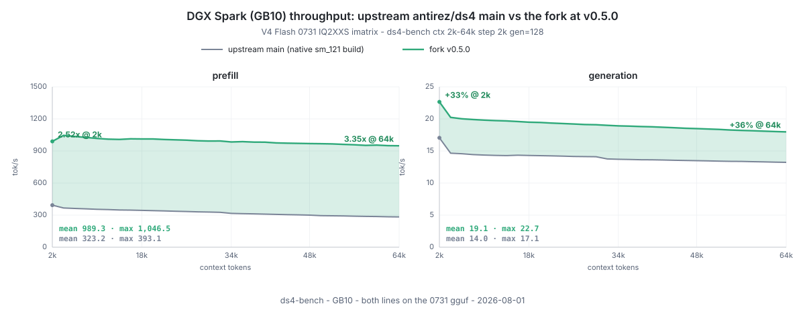
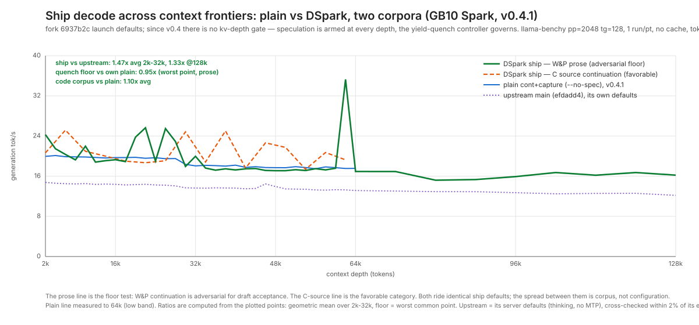
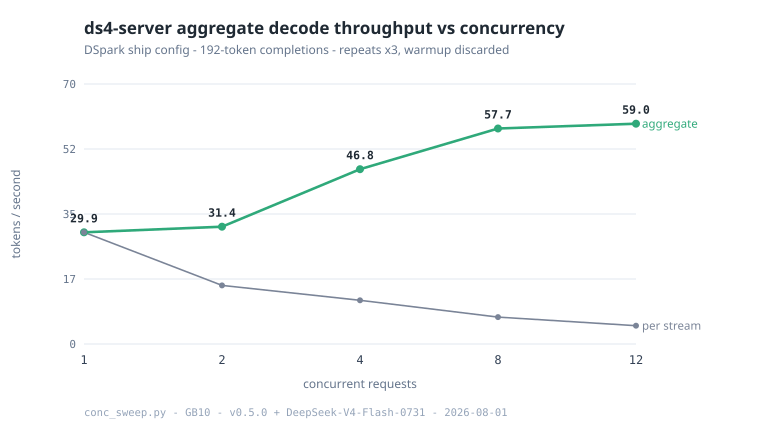

# ds4-on-spark

One command gets **[`Entrpi/ds4`](https://github.com/Entrpi/ds4/tree/batched-serving)** serving
**DeepSeek-V4-Flash** on your DGX Spark, entirely on-device (GB10 / SM121,
128 GB unified memory, ~119 GiB usable; RTX PRO 6000 / 5090-class
`sm_120` also builds). `Entrpi/ds4` is a major-feature fork of
[`antirez/ds4`](https://github.com/antirez/ds4) (DwarfStar 4) that builds
the upstream engine into a batched multi-request server for Blackwell
CUDA. Upstream remains the architectural foundation and the model recipe;
this repo pins and packages the fork.

Compared to the upstream engine you get **2.4-3.3x the prefill
throughput**, **1.33-1.47x the decode speed across the full 2k-128k
context range**, continuous batching, prefix caching with disk-persisted
KV banks that survive restarts, DSpark lossless speculative decode, and
since v0.6 a memory governor measured up to **3 million tokens of
active context resident and warm at once** on a single Spark
(2.26 million with every shipped default intact;
[recipe and receipts](#reaching-3m-tokens-of-active-context)). The
[fork delta table](#what-the-fork-adds-over-upstream) itemizes exactly
what changed and how each claim was measured.

**Status:** working end-to-end, pinned to fork release
[**`v0.6.3`**](https://github.com/Entrpi/ds4/blob/v0.6.3/CHANGELOG.md),
the real-budgets release. The engine keeps a single account of its
memory and makes every decision from it: requests are charged what they
will actually use, every floor and margin in the plan is derived from a
measurement rather than a constant, idle memory returns to the pool
after a couple of minutes of quiet, and when something truly does not
fit you get a clear refusal that says how many bytes were missing and
whether retrying will help, never a crash. While serving, the engine
audits its own account: an idle reconciliation line checks the box's
raw memory drop against the ledger and logs the residual. The default
launch context is 512k. The details and every knob are in
[Memory and context](#memory-and-context-the-knobs-that-matter); the
per-release story is in the fork
[CHANGELOG](https://github.com/Entrpi/ds4/blob/v0.6.3/CHANGELOG.md).

The pieces:

- **Engine:** [`Entrpi/ds4`](https://github.com/Entrpi/ds4) pinned at `v0.6.3`, cloned and built native `sm_121` by the installer.
- **Model:** [`antirez/deepseek-v4-gguf`](https://huggingface.co/antirez/deepseek-v4-gguf), the DeepSeek-V4-Flash-**0731** ~81 GiB asymmetric quant (IQ2_XXS routed gate/up, Q2_K routed down, Q8_0 everything else dense, F16 compressor/indexer; FP8 in ds4 is a runtime KV-cache format, not a stored weight format), plus the ~6.5 GiB DSpark drafter from [`bleysg/DeepSeek-V4-Flash-DSpark-drafter-GGUF`](https://huggingface.co/bleysg/DeepSeek-V4-Flash-DSpark-drafter-GGUF). The 0731 checkpoint has no MTP head; DSpark is the only speculation.
- **Hardware:** NVIDIA DGX Spark (GB10, SM121, 128 GB LPDDR5X unified). See [Hardware requirements](#hardware-requirements).

## Quick start

On a DGX Spark with CUDA 13 installed:

```bash
curl -sSL https://raw.githubusercontent.com/entrpi/ds4-on-spark/main/install.sh | bash -s -- --start
```

That one command:

1. Verifies the host (aarch64, GB10/SM121, CUDA 13, ≥120 GiB free disk).
2. Clones the `Entrpi/ds4` fork at the pinned release tag (currently
   **`v0.6.3`**) into `~/code/ds4` (or `$DS4_SRC_DIR`).
3. Builds `ds4`, `ds4-server`, `ds4-bench` with `CUDA_ARCH=sm_121` in ~8 s.
4. Downloads the DeepSeek-V4-Flash-**0731** Q2 GGUF (~81 GiB) from
   [`antirez/deepseek-v4-gguf`](https://huggingface.co/antirez/deepseek-v4-gguf)
   and the matching 0731 DSpark Q2K drafter (~6.5 GiB) from
   [`bleysg/DeepSeek-V4-Flash-DSpark-drafter-GGUF`](https://huggingface.co/bleysg/DeepSeek-V4-Flash-DSpark-drafter-GGUF)
   into `~/gguf` (or `$DS4_GGUF_DIR`). No MTP file — the 0731 checkpoint
   has no MTP head.
5. Runs the "capital of France" smoke test and asserts "Paris" in the output.
6. Installs the **`ds4-serve`** launcher to `~/.local/bin`.
7. Starts `ds4-server` on `:8000` with `-c 524288` (512K — room for deep
   document ingestion alongside full agent-harness windows; the model is
   1M-native, and since v0.6 unused context is demand-mapped, not hoarded)
   serving the **full DSpark speculative stack** — lossless,
   quench-governed, armed at every depth (v0.5.0 defaults; the break-even
   guard is calibrated to the 0731 model identity).

`--no-dspark` serves plain continuous decode instead (skips the drafter
download). On 0731 the fallback ladder is DSpark → plain; `--with-mtp`
(MTP-2 speculation, a modest ~1.08×) applies only to the legacy
generation's base + MTP files.

To preview without running:

```bash
curl -sSL https://raw.githubusercontent.com/entrpi/ds4-on-spark/main/install.sh | bash -s -- --help
```

Common overrides: `--cuda-arch sm_120` (RTX PRO 6000 / 5090-class Blackwell; datacenter B200/B300 is `sm_100`, untested), `--no-download`
(reuse existing GGUF), `--src-dir`, `--gguf-dir`, `--ctx`, `--port`, `--force`
(skip host check).

## Serving: `ds4-serve`

The installer puts `ds4-serve` on your PATH. The full-stack launch is
one command; every optimization is default-on and you only pass what you
want to change:

```bash
ds4-serve                              # full stack, ctx 524288, 127.0.0.1:8000
ds4-serve -c 1048576                   # the model's full 1M window
ds4-serve -c 32768 --host 0.0.0.0      # smaller context, reachable from LAN
```

Anything you pass goes straight to `ds4-server` and overrides the
defaults (`ds4-server --help` lists everything, `--cors` included).
`--no-dspark` / `--no-spec` serve plain continuous decode instead. It
runs in the foreground; supervise with nohup/systemd/tmux as you prefer.

Sizing `-c` stopped being a memory decision in v0.6: unused context is
demand-mapped, so a deep `-c` costs almost nothing until a request
actually fills it. The default is 512k; the model's full 1M window
(`-c 1048576`) is qualified to the last token (deepest proven: a
1,029,340-token prompt with the needle at 99.9% depth retrieved
exactly).
What each request pays for is its prompt plus its
decode budget (`max_tokens`, assumed 32768 when the client omits it),
and how many requests can hold context at once is the bank count. Both
are explained in
[Memory and context](#memory-and-context-the-knobs-that-matter).

## Connecting agents

`ds4-server` speaks four APIs from one continuous batch: OpenAI chat
completions and completions, OpenAI Responses (the surface Codex uses),
and Anthropic Messages (the surface Claude Code uses). Streaming, tool
calls, and thinking all ride the batched path.

### Pointing OpenAI Codex at the box

With ds4 v0.5.6.2+ and this repo's installer, Codex self-configures:
the installer drops a model catalog at `~/.config/ds4/codex-models.json`
and `ds4-serve` serves it from `/v1/models` in the schema Codex expects
(real 512K context window, working auto-compaction, Codex's own agent
instructions). All Codex needs is the provider block:

```toml
# ~/.codex/config.toml
model = "deepseek-v4-flash"
model_provider = "ds4"

[model_providers.ds4]
name = "ds4"
base_url = "http://YOUR_SPARK:8000/v1"
wire_api = "responses"
```

If you boot a different `-c`, edit `context_window` (and
`auto_compact_token_limit`, which should sit comfortably below it) in
`~/.config/ds4/codex-models.json` to match — the server warns at boot
on a mismatch. Booting ds4-server directly instead of via ds4-serve:
`export DS4_CODEX_MODELS_FILE=~/.config/ds4/codex-models.json`. On
older servers (or without the served catalog) the same file works
client-side via `model_catalog_json = "~/.codex/ds4-codex-catalog.json"`
after downloading [`codex/ds4-codex-catalog.json`](codex/ds4-codex-catalog.json).

Background, for the curious: the catalog carries Codex's default agent
instructions verbatim (captured from codex-cli 0.144.1, an Apache-2.0
open source project — an empty `base_instructions` measurably
lobotomizes the agent) and declares no reasoning levels (DeepSeek's
long thinking blocks make Codex compaction thrash). ds4 v0.5.6.2 fixed
the two server-side failure modes found while validating this:
tool-call markup leaking into compaction summaries, and silent
thinking turns tripping Codex's ~300 s idle timer. Claude Code needs
none of this; its compaction works against the Anthropic surface out
of the box.

### Claude Code, opencode, Pi

Claude Code works against the Anthropic surface out of the box: point
`ANTHROPIC_BASE_URL` at `http://YOUR_SPARK:8000` and select the model
`deepseek-v4-flash`. A complete wrapper script, plus provider configs
for opencode and Pi, are in the engine README's
[Agent Client Usage](https://github.com/Entrpi/ds4#agent-client-usage)
section.

## Memory and context: the knobs that matter

Since fork v0.6 the engine keeps a single account of its memory and
makes every decision from it. Nothing is reserved up front: context
lives in virtual banks whose pages materialize only as requests fill
them, each admission is charged the memory it will actually use, and
idle memory returns to the pool after a couple of minutes of quiet.
When something truly does not fit, you get a typed refusal that says
how many bytes were missing and whether retrying can help, never a
crash. An absolute floor protects the box itself: no admission may push
system free memory below 4 GiB.

Two decisions cover most operator needs:

- **Context limit** (`-c`) is the per-request ceiling. A request pays
  for its prompt plus its decode budget (`max_tokens`, assumed 32768
  when omitted), and that sum must fit under `-c` or the request gets a
  clean typed 400. A deep `-c` itself is free until used.
- **Bank count** is how many requests can hold warm context at once.
  It is derived from `-c` at boot (32 banks at 32k context, halving as
  the context grows, floor 4 from 256k up) and fixed for the server's
  lifetime. An admission beyond the bank count evicts the
  least-recently-used idle bank; it does not refuse.

| Knob | Default | What it does and when to change it |
|---|---|---|
| `-c` / `--ctx` | `524288` via `ds4-serve` (the bare CUDA engine defaults to `262144`) | The per-request context ceiling. Each request must fit its prompt plus its decode budget under this, or it gets a typed 400. Raise it for deeper documents (a 1,029,340-token prompt at `-c 1048576` is the deepest proven); unused context is demand-mapped, so a deep ceiling costs almost nothing until a request fills it. |
| `DS4_SERVER_COALESCE_MAX` | unset: sized from the live memory budget at boot — 32 through 16k context (the measured regime); above that, as many full-depth-fundable banks as the budget covers (floor 4, cap 32), priced at the same per-token rate admissions are charged. The boot ledger prints the arithmetic (`kv plan` line). Where no memory answer exists (Metal/CPU), a static halving ladder rules instead. | How many requests can hold warm context at once (the bank count). Set it (1..64) to override — an explicit value also disarms the budget sizing, so your number rules (e.g. more, shallower banks for high-concurrency batch work). Boot may still reduce the count to fit memory, never raise it, and it is fixed until restart. A request beyond the bank count evicts the least-recently-used idle bank. |
| `--mem-floor-gb` (env `DS4_MEM_FLOOR_GB`) | `4` | The engine never admits work that would leave the system under this many GiB of free memory: it reclaims idle cache first and refuses with a typed error if that is not enough. Lower it (down to 1) on a dedicated serving box to fund more context; raise it on a machine you also work on. |
| `max_tokens` (request field, not a flag) | `32768` assumed when the client omits it | The decode budget a request is charged at admission, on top of its prompt. Agents that omit it are charged the full 32768, so set it explicitly when a deep prompt must fit: prompt + `max_tokens` must stay under `-c`. An oversized value is clamped and reported as `length`, never an error. |
| `DS4_CONT_ADMIT_BAND_X1024` | `1045` | Admission charges each request its measured memory need times a small safety margin, expressed in 1024ths: 1045/1024 means about 2% above the measurement, absorbing allocation transients. Set `1024` to charge exactly the measured need; raise it if admitted work ever brushes the floor. |
| `DS4_MEMGOV` | unset (the governor's verdicts are binding) | Set to `observe` to fall back to the pre-v0.6 memory formulas: the governor keeps evaluating and reporting on `/metrics`, but stops deciding. The one-word escape hatch if a memory decision ever looks wrong. |
| `DS4_CONT_PREFILL_CHUNK` / `DS4_CONT_PREFILL_CHUNK_LIVE` | `4096` / `4096` | Long prompts are ingested this many tokens at a time so a big admission never blocks the server. The `_LIVE` value applies while other requests are actively decoding: smaller keeps live decode smoother, larger ingests faster. |
| `DS4_SERVER_CONTINUOUS` | `1` (continuous batching on) | Set to `0` to serve one request at a time on the old serial path. Only worth considering for single-user, latency-critical setups. |
| `DS4_BATCH_VMM_TRIM` | `1` (reclaim allowed) | When an admission does not fit, the engine may release idle banks' memory to fund it; the reclaimed conversation then needs a disk restore or re-prefill when it returns. Set to `0` to forbid that: resident context is never sacrificed, and the admission is refused instead. |

The shipped-defaults proving run booted zero-config at `-c 786432` and
admitted three ingestions of about 755 thousand tokens each, back to
back: **2.26 million tokens of context resident and warm at once**,
zero refusals, the 4 GiB floor intact. A fourth deep ingestion was
funded by reclaiming an idle bank (the cheapest to restore), not
refused.
Decode measured at parity with an empty box at 450k-token depth and
within 15 percent at 755k; the observed all-in cost was about 4.3 KiB
per token of resident context.

The window itself reaches the model's full million: at `-c 1048576` a
single conversation of **975,246 tokens** was admitted and continued
warm in place, with a 2.0 s time to first token and decode at 88 ms
per token at that depth.

### Reaching 3M+ tokens of active context

The proving run above kept every protective default. To push a Spark to
its actual ceiling, remove the three things that stop the fill before
the memory does:

1. **Strip the host first.** A desktop-image Spark spends 10-15 GB of
   unified memory on GNOME, snaps, and maintenance timers.
   [dgx-spark-serving-mode](https://github.com/Entrpi/dgx-spark-serving-mode)
   switches the box between desktop and headless serving profiles (SSH,
   networking, and the NVIDIA plumbing stay; the desktop goes, and comes
   back with `off`). That is the first ~10 GB of headroom.
2. **Lower the refusal floor.** `DS4_MEM_FLOOR_GB=1` moves the
   admission line from 4 GiB free to 1 GiB free. Reasonable on a
   dedicated serving box; keep the default 4 on a machine you also
   work on.
3. **Pin the bank plan.** `DS4_SERVER_COALESCE_MAX=6` with
   `-c 786432`: at ~755k tokens per ingestion the fill needs a fifth
   bank. Current engines size the bank count from the live budget at
   boot and usually cover this on their own; the explicit value
   disarms that sizing and makes the plan deterministic, which is
   what the measured run used.
4. Optional, for strict residency guarantees: `DS4_BATCH_VMM_TRIM=0`
   makes the engine refuse new work outright instead of reclaiming idle
   banks' memory to fund it, so resident context is never sacrificed.

```bash
DS4_MEM_FLOOR_GB=1 DS4_SERVER_COALESCE_MAX=6 DS4_BATCH_VMM_TRIM=0 \
  ds4-serve -c 786432
```

Measured with exactly this configuration (2026-08-18, a worked box
booting with 14.3 GiB free): **3,019,176 tokens of active context** —
four ingestions of ~755k tokens each, a needle retrieved exactly from
every one, and then honest, instant refusals for every further ask
(740k down to 92k) with the 1 GiB floor intact (observed minimum
1.1 GiB free). A stripped fresh box boots with more free and lands
correspondingly higher.

The honest cost: at that full squeeze, decode ran 2.6x slower than an
empty box (the OS starts reclaiming file-backed weight pages when
almost nothing is free). At 2.26M under the shipped 4 GiB floor the
same stamp is 1.14x. The last ~750k tokens of capacity are paid for
in decode speed; that trade is exactly what the floor setting
controls.

One hardware note: otherwise identical GB10 boxes do not report the
same total memory. Of the two reference machines behind this README,
one reports `MemTotal` 127,535,152 kB and the other 125,442,416 kB, a
2.0 GiB gap. Budget against `MemAvailable` measured on your own box,
not against numbers from someone else's.

### If you come from vLLM or SGLang

The design assumption differs. vLLM and SGLang assume a dedicated GPU:
claim a fixed fraction of its memory at boot, then manage KV inside
that reservation. ds4 assumes a 128 GB unified-memory box that is also
running an OS and maybe your other work: hoard nothing, measure every
admission against live free memory, and refuse with a reason rather
than degrade. Flag semantics below were checked against the vLLM and
SGLang docs in August 2026.

| | ds4 v0.6 | vLLM | SGLang |
|---|---|---|---|
| Context limit | `-c` (default 512k installed, 256k bare engine) | `--max-model-len` (default: model config) | `--context-length` (default: model config) |
| Memory reservation | none; banks are virtual, pages materialize on use | `--gpu-memory-utilization` fraction pre-reserved at boot (default 0.9) | `--mem-fraction-static` pre-reserved at boot (default auto, ~0.88) |
| Concurrency | bank count, derived from `-c` (override `DS4_SERVER_COALESCE_MAX`) | `--max-num-seqs` | `--max-running-requests` |
| Admission control | each request charged its measured prompt + decode budget against live free memory | fits if KV blocks are available inside the reservation | fits if pool tokens are available inside the reservation |
| When memory runs out | typed refusal stating the byte shortfall and whether retry can help; a 4 GiB floor (`--mem-floor-gb`) protects the host | preempts a request and recomputes it later (V1 default) | retracts a request and re-queues it |
| Prefix reuse | warm KV banks plus disk-persisted banks that survive restarts | prefix caching (on by default in V1) | radix cache (on by default) |
| Chunked prefill | on by default (`DS4_CONT_PREFILL_CHUNK`), interleaved with live decode | on by default in V1 | `--chunked-prefill-size` |

## Upgrading from an earlier install

Re-run the installer — every step is idempotent:

```bash
pkill -x ds4-server   # the installer starts servers but never stops old ones
curl -sSL https://raw.githubusercontent.com/entrpi/ds4-on-spark/main/install.sh | bash -s -- --start
```

What happens to an existing setup:

- **Your ds4 clone fast-forwards to the pinned tag** (`git fetch` +
  `reset --hard`, remote repointed automatically if you installed back when
  this repo cloned `antirez/ds4`). Any local edits in that clone are
  **discarded** — it's an installer-managed tree.
- **The model generation moves to the DeepSeek-V4-Flash-0731 weights**: the
  installer downloads the 0731 imatrix base (~87 GiB) and the matching 0731
  DSpark drafter (~7 GiB). The 0731 checkpoint has **no MTP head** (the
  single-block MTP module was replaced upstream by the DSpark stages), so no
  MTP file is downloaded and the serve fallback ladder for 0731 is
  DSpark → plain — the launcher refuses to pair the legacy MTP file with a
  0731 base.
- **Previous-generation weights are detected and offered for removal**
  (old base + old MTP + old drafter, ~91 GiB — the old drafter was distilled
  against the old base's hidden states and would crater speculative accept on
  0731). Removal is **optional and prompted**, and only happens after the new
  weights pass the smoke test — unless disk space forces it first, in which
  case the installer asks (or honors a flag) *before* downloading:
  - `--remove-old-weights` — no prompt; delete (before the download only when
    space requires it, otherwise after the smoke test passes).
  - `--keep-old-weights` — no prompt; keep (the upgrade stops early with a
    clear message if the download cannot fit alongside them).
  - no flag — interactive prompt when a terminal is attached; otherwise the
    old files are kept and a warning says so.
- **To stay on the previous generation** (and keep the MTP path), pin the old
  file names — generation is detected from the base name:
  `GGUF_FILE=DeepSeek-V4-Flash-IQ2XXS-w2Q2K-AProjQ8-SExpQ8-OutQ8-chat-v2-imatrix.gguf DSPARK_FILE=DSpark-drafter-Q2K-Q8.gguf ./install.sh --start`
- **If you keep the legacy files alongside 0731**: `ds4-serve` refuses the
  legacy-MTP × 0731 pairing. A bare `ds4-server` boot with launch defaults
  can still auto-attach the legacy MTP file to a 0731 base — as of v0.5.1
  that is measured safe: the cross-generation pairing drafts at ~52%
  accept (right at speculative break-even, ~equal to plain decode, and
  lossless by construction), and the engine now watches every MTP module's
  accept rate and loudly disables one that drafts near-random (a genuinely
  wrong or corrupt file). For best speed still prefer the matched setup —
  the DSpark drafter on 0731, or `--no-mtp` on mixed directories.
- If a rebuild ever looks wrong after a big jump, `make -C ~/code/ds4 clean`
  and re-run.

## Hardware requirements

| | |
|---|---|
| Validated on | NVIDIA DGX Spark (GB10, SM121, 128 GB / ~119 GiB unified) |
| Likely to work | RTX PRO 6000 / 5090-class Blackwell with `--cuda-arch sm_120` (PRO 6000 prefill measured); `sm_100` datacenter untested |
| CUDA toolkit | 13.x (we tested 13.0.88) |
| Disk | ≥110 GiB free for the GGUFs |
| OS | aarch64 Linux (Grace) |
| RAM (system, unified) | 128 GB (~119 GiB usable) is enough for the model + ~250 MB KV @ 16k context |

GB10 is detected via `nvidia-smi --query-gpu=compute_cap` returning `12.1`.
Anything else gets a warning + `--force` override path.

## What you get

| Binary | Purpose |
|---|---|
| `ds4` | Interactive / one-shot CLI |
| `ds4-server` | HTTP server: OpenAI + Anthropic APIs from one continuous batch |
| `ds4-bench` | Direct prefill + decode throughput sweep (no HTTP) |

`ds4-server` is the recommended runtime. All four API surfaces run in
the continuous batch, buffered and streaming:

- `POST /v1/chat/completions` and `POST /v1/completions` (OpenAI)
- `POST /v1/responses` (OpenAI Responses, used by Codex)
- `POST /v1/messages` (Anthropic Messages, used by Claude Code)
- `GET /v1/models`, `GET /metrics` (Prometheus), `GET /v1/stats` (live status board)

## Performance

Every number in this README comes from a single DGX Spark (GB10,
`sm_121`, `compute_cap=12.1`, CUDA 13.0.88), measured through the real
serving path ([`eugr/llama-benchy`](https://github.com/eugr/llama-benchy),
non-streaming wall tok/s) unless marked engine-side. Older numbers keep
their release stamps; serving performance is unchanged across the
releases since each stamp (byte-exact or ABBA-parity at every cut).

### What the fork adds over upstream

[`Entrpi/ds4`](https://github.com/Entrpi/ds4) tracks upstream and specializes
it for **Blackwell CUDA serving performance**. Everything below is fork-side
work, measured engine-to-engine against upstream `main` on the same GB10, same
GGUF (upstream decode measured flat May → July 2026):

| Area | Fork | vs upstream |
|---|---|---|
| **Prefill** | D2R ("dequant-to-register") tensor-core MoE GEMMs — IQ2_XXS / Q2_K / Q8_0 expert weights dequantized directly into MMA fragments from aligned SoA artifacts; token-tile HMMA attention; L2-reuse-aware expert-major CTA schedule; flat activation pool (v0.5.0 — every per-layer requantize pass retired, bit-exact) | **2.43× @2k, 3.30× @64k on GB10** (vs main `54b36ed` rebuilt native, 2026-08-01, both lines on the 0731 gguf; 305 → ~1,010 tok/s @12k over the fork's own arc; ~4× on RTX PRO 6000 at the v0.1.0 stamp) |
| **Decode** | Per-layer CUDA-graph capture at every context depth (v0.5.0 — a streaming top-512 selection tier removed the old >8k-row capture cliff); head-group flash-decode for dense and indexed attention (v0.4.0); aligned-quant dispatch tiers at every verify width | **1.33–1.47× across 2k–128k context** at the ship config (v0.4.1 stamp, [chart](docs/v041_upstream_overlay.svg)); deep decode a further **−11% ms/tok @240k** in v0.5.0 |
| **Speculation** | DSpark lossless block drafter (3-layer target-fused, Q2K) + terminal yield-quench (net-positive per request, default on); armed at every depth since v0.4.0 — no kv-depth gate; break-even guard recalibrated per model identity (v0.5.0: 2.16 for 0731) | upstream MTP was single-token, net-negative single-stream — and the 0731 checkpoint retired it entirely (DSpark is the only speculation); fork code-corpus band **1.10×** its own plain decode, adversarial prose 1.04× (typical quench floor 0.95–0.97×, bounded learning debt); the vs-upstream win is the headline |
| **Serving** | Continuous batching (mid-flight admit/evict, chunked prefill interleave), per-bank warm start (~7× TTFT on shared prefixes), fork-by-copy fanout, durable disk-persisted KV banks (v0.3.0), OpenAI + Anthropic-shape APIs | upstream serves one stream; fork aggregate **59 tok/s at 12 concurrent requests** (v0.5.0, [chart](docs/v050_conc_throughput.svg)) |
| **Thinking-mode turns** | Thinking conversations reuse KV on the continuous path and persist to the disk tier (v0.4.2, community fix by [@fabiopili](https://github.com/fabiopili), [PR #4](https://github.com/Entrpi/ds4/pull/4)) | turn-2 TTFT **53.9 s → 0.69 s** on a 29k-token thinking preamble (full re-prefill pre-fix vs `fork admit cached=32792`; DGX Spark, ctx 49152, 2026-07-24 stamp) |
| **Ops** | Resident weight server (VMM-backed, IPC manifest) — engines import the 81 GiB model in seconds instead of multi-minute reloads; builds the aligned repack artifacts the fast kernels read in place | upstream reloads per process |
| **Telemetry** | Per-step speculative trace + offline policy replayer (`tools/dspark_trace_replay.py`), quench/gate/profile counters | — |

Every fork-side change is documented in the fork
[`CHANGELOG.md`](https://github.com/Entrpi/ds4/blob/v0.5.0/CHANGELOG.md);
the [roofline analysis](#roofline-why-speculation-and-batching-are-the-levers)
below explains why these are the changes that matter on this hardware.

**Prefill and generation vs upstream, across the context frontier** (upstream
`main` at `54b36ed` rebuilt native `sm_121`, measured 2026-08-01 on the same
box, same instrument, both lines on the same DeepSeek-V4-Flash-**0731** gguf;
the fork line is the launch-default ship config this installer boots —
2.43× prefill at 2k, 3.30× at 64k):



**Decode at the ship config** (DSpark + yield-quench; since v0.4.0 there is
no kv-depth gate — speculation is armed at every depth and the quench
controller governs) — solid green is the adversarial-prose floor test,
dashed orange is code continuation; the fork's ship decode runs 1.47× the
upstream engine on the low band and 1.33× at 128k. Its own-plain floor is
the quench controller's bounded learning debt on short generations:
typically 0.95–0.97× on adversarial prose (band geomean 1.04×), with
post-quench serving measured identical to plain (forced-quench identity
1.000–1.004; see the fork CHANGELOG v0.4.1 for the measured mechanism):



### Benchmarks

The headline numbers in one place (re-stamped at v0.5.0 on the 0731
weights, 2026-08-01, unless marked with an earlier stamp):

| metric | value | evidence |
|---|---|---|
| Prefill (engine-side) | ~960 tok/s @2k, ~1,010 @12k, ~933 @64k — **2.43× upstream @2k, 3.30× @64k** (~4× on RTX PRO 6000 at the v0.1.0 stamp); 515K tokens admitted at **776 tok/s** sustained | [frontier chart](docs/v050_upstream_overlay.svg) |
| Plain continuous decode | 20.0 tok/s @2k, 17.7 @48k (`--no-spec`) — v0.4.1 stamp | [decode chart](docs/v041_decode_overlay.svg) |
| Ship decode vs upstream | **1.47×** low-band geomean, 1.33× @128k, spec armed at every depth — v0.4.1 stamp | [frontier chart](docs/v041_upstream_overlay.svg) |
| DSpark decode, 9-workload suite | mean **27.7 tok/s (1.38×)**, best 34.5 (1.71×) — v0.1.1 stamp, predates the faster v0.4.0 plain baseline | [suite table](#dspark-the-featured-serving-mode) |
| DSpark vs own plain | code-corpus band **1.10×** geomean, adversarial prose 1.04× (typical quench floor 0.95–0.97×, bounded learning debt) | [two-corpus chart](docs/v041_decode_overlay.svg) |
| Deep serving decode (engine-side) | **45.7 ms/tok @240K at ~2.9 tok/step** — capture at every depth (v0.4.1: 57.3, v0.3.0: 76.3) | [fork changelog](https://github.com/Entrpi/ds4/blob/v0.5.0/CHANGELOG.md) |
| Concurrent serving | **59 tok/s aggregate** @12 concurrent, saturating ≈8–12 requests (v0.1.1 stamp: ~30, saturating ≈4) | [concurrency chart](docs/v050_conc_throughput.svg) |
| Build | `make CUDA_ARCH=sm_121` ≈ 8 s | installer output |
| Cold start | ~20 s direct model attach; **seconds** as a weight-server client | — |

Reproduce on your own Spark:

```bash
# install + serve the DSpark ship default on :8000
curl -sSL https://raw.githubusercontent.com/entrpi/ds4-on-spark/main/install.sh | bash -s -- --start

# llama-benchy against the running server (needs uv: https://docs.astral.sh/uv/)
./scripts/run-bench.sh --pp 2048 --tg 128 512 --depth 0 4096 16384

# concurrency sweep (the concurrency chart's shape)
./scripts/run-bench.sh --pp 2048 --tg 256 --concurrency 1 2 4 8 16

# plain-decode comparison leg
pkill -x ds4-server; ./install.sh --start --no-dspark

# raw memory-bandwidth ceiling (feeds the roofline below)
/usr/local/cuda/bin/nvcc -O3 -arch=sm_121 bench/bw_bench.cu -o /tmp/bw_bench
/tmp/bw_bench 8192
```

### DSpark: the featured serving mode

Since fork `v0.1.1`, the featured runtime is **continuous batching + DSpark
lossless speculative decode** (a DFlash-style drafter verified by the target
model — the verify forward is the sole token source, so output is lossless by
construction; quality held at gsm8k 97.5 % / mbpp 92.5 % through the full
serving path at the release gate).

Measured on GB10 with llama-benchy's `mtp-bench` suite (9 workloads × 3 runs,
512 tokens, non-streaming wall tok/s):

| workload | plain t/s | DSpark t/s | gain | tok/step | accept |
|---|---|---|---|---|---|
| stepwise_math | 20.1 | 34.5 | **1.71×** | 4.00 | 89 % |
| qa_factual | 19.6 | 31.9 | 1.63× | 3.89 | 91 % |
| summarize | 19.6 | 31.0 | 1.59× | 3.88 | 87 % |
| code_cpp | 20.4 | 30.0 | 1.47× | 3.38 | 80 % |
| translation | 20.4 | 27.9 | 1.37× | 3.10 | 76 % |
| code_python | 20.5 | 26.4 | 1.29× | 2.94 | 72 % |
| explain_concept | 20.5 | 25.2 | 1.23× | 2.80 | 69 % |
| long_code_review | 18.8 | 22.1 | 1.17× | 2.62 | 66 % |
| creative_short | 20.6 | 19.9 | 0.96× | 2.18 | 58 % |
| **suite mean** | **20.1** | **27.7** | **1.38×** | — | — |

<sub>Stamped 2026-07-11 at the v0.1.0 release cut (Q4K drafter, `-c 4096`,
non-streaming `usage`-counted wall tok/s). The Q2K drafter — the v0.1.1
default — measured equal-or-better in a same-script A/B (suite mean 28.8 vs
28.3, acceptance within ±3 pp per workload).</sub>


The chart is the honest version of the same story across context depth,
re-measured at v0.4.1 (2026-07-22): the solid green line is **War & Peace
continuation** — deliberately the hardest corpus, at or just under
break-even — and the dashed orange line is **C-source continuation**
(1.10× plain on average at this shape). The vs-plain margins are thinner
than the v0.1.1 chart showed because v0.4.0's plain baseline absorbed the
arc's decode gains (plain itself is 9–26 % faster than v0.1.1's plain,
growing with depth); the purple reference line is upstream main, measured
2026-07-21 on the same box and instrument. Content decides the win; the
safety nets bound the losses:

- a **terminal yield-quench controller** (default on) that turns speculation
  off for the rest of any request whose realized acceptance can't pay its
  verify cost. Its worst case is a bounded learning cost — a few
  speculative steps of evidence before the quench fires — landing short
  adversarial generations at 0.95–0.97× plain on typical draws (chart
  worst point 0.95×; post-quench serving measures identical to plain,
  forced-quench identity 1.000–1.004), versus 0.72× for always-on
  speculation on the same corpus;
- since v0.4.0 the quench controller is the *only* governor: the static
  kv-depth gate is gone and speculation stays armed at every depth (v0.4's
  flash-decode rewrites cut the width-5 verify cost that motivated the
  gate). Setting `DS4_DSPARK_MAX_KV=N` restores a hard depth cap if you
  want one.

#### The break-even law

One DSpark verify step (1 committed row + 4 draft rows through the full
model) costs **2.03–2.08 plain decode steps** on GB10 across the 2k–64k
band (measured at v0.4.1; it rises to ~2.4 at 240K–515K depth). So

```
speedup = tokens-per-step ÷ ~2.05       break-even ≈ 51 % draft acceptance
```

Everything above follows from this: structured content accepts 70–90 % of
drafts (1.3–1.7×), open-ended prose sits near break-even, and the quench
controller is just this law enforced per request — it accumulates the
cumulative regret `guard − tokens-per-step` each verify step and terminally
quenches the request when the deficit exceeds ~4 plain-step times. The
guard sits AT the measured break-even and is recalibrated per model
identity (v0.5.0: **2.16** for the 0731 weights; v0.4.1 cut the
v0.1.1-era 2.22 to 2.10 after v0.4's flash-decode rewrites reduced the
verify cost — a stale guard terminally quenches winners). The parameters are
calibrated offline against per-step traces (`DS4_DSPARK_TRACE=1` +
`tools/dspark_trace_replay.py` in the fork) and the in-engine controller is
validated to reproduce the offline policy exactly.

#### The drafter artifact

The installer downloads the prebuilt ~6.5 GiB Q2K drafter matching your
base's generation (`DSpark-drafter-Q2K-Q8-0731.gguf` for 0731) from
[`bleysg/DeepSeek-V4-Flash-DSpark-drafter-GGUF`](https://huggingface.co/bleysg/DeepSeek-V4-Flash-DSpark-drafter-GGUF)
by default. Drafters are generation-matched — a drafter is distilled
against its own base's hidden states, and the 0731 re-extraction measures
accept parity with the old pairing (73.7% / 3.08 tok/step at 12k). Q2K
routed experts are the ship default (equal throughput and acceptance to
Q4K in A/B, 4.2 GiB smaller). To build a drafter yourself from
the official checkpoint's drafter shards (e.g. the Q4K-expert variant), use
the fork's extraction tool:

```bash
cd ~/code/ds4
python3 gguf-tools/dspark_extract.py --src <dir-with-drafter-shards> \
    --out ~/gguf/DSpark-drafter-Q4K-Q8.gguf --validate --experts q4_k
```

Kill switches if you ever need them: `DS4_DSPARK_QUENCH=0` (always-spec, no
quench), `DS4_DSPARK_MAX_KV=N` (restore a hard depth cap), `--no-dspark` at
install / `DS4_CONT_DSPARK` unset (no DSpark).

### Roofline: why speculation and batching are the levers

Kernel-effective memory bandwidth measured on GB10 with
[`bench/bw_bench.cu`](bench/bw_bench.cu): **~215 GB/s** copy (read+write),
**~227 GB/s** read-only — ~82 % of the 273 GB/s theoretical LPDDR5X peak,
normal for real workloads. Decode activates **~11 GB per token** (bottom-up
from the safetensors index: 6/256 routed experts ≈ 1.8 GB, plus the dense
attention/indexer/compressor stack, output head, shared expert, and KV
reads — all of which are touched every token). That puts a hard bandwidth
roofline on single-stream plain decode of about **225 / 11 ≈ 20.5 tok/s**,
and the engine's plain decode measures 18–20 — i.e. **~90 %+ of the wall**.
(±20 % on the bytes-per-token estimate moves the efficiency figure, not the
conclusion.)

That is the design rationale for everything this fork features. Once plain
decode sits at the bandwidth wall, the only ways forward are:

- **commit more tokens per weight sweep** — DSpark verifies 1+4 draft rows in
  one sweep (suite mean 1.38×, structured content up to 1.71×); or
- **share the sweep across requests** — continuous batching (59 tok/s
  aggregate at 12 concurrent requests); or
- **read fewer bytes** — a tighter quant (FP4 / 1.5-bit experts), not
  currently pursued.

### Concurrency on `ds4-server`

Since the fork's batched-serving line (v0.1.0+), `ds4-server` runs
**continuous batching by default**: concurrent requests are admitted
mid-flight into per-sequence KV banks, prefill is chunked and interleaved
with live decode, and the multi-sequence forward scales ~6× from batch 1 to
128 in the engine. Per-bank warm start and fork-by-copy give large TTFT wins
on shared-prefix fan-out. `DS4_SERVER_CONTINUOUS=0` restores the old
serialized behaviour; for single-user latency-critical use that can still
be the right call. DSpark speculation engages on solo streams (the default
`DS4_DSPARK_MAX_NLIVE=1` regime) and hands concurrent traffic to plain
batched decode, which wins above N=1 today.

Measured at the ship default (v0.5.0 on the 0731 weights, 192-token
completions, repeats ×3 with warmup discarded):



Aggregate decode rises 29.9 → 59.0 tok/s and saturates around 8–12
concurrent requests — double the v0.1.1 stamp (~30 tok/s, saturating ≈4);
per-request throughput falls as requests share the machine
(29.9 / 15.7 / 11.7 / 7.2 / 4.9 tok/s at c = 1/2/4/8/12, each measured
over that request's own generation window). The c=1 point runs DSpark
solo (the `DS4_DSPARK_MAX_NLIVE=1` regime); concurrent traffic rides
plain batched decode. That is the practical guidance: a single agent gets
DSpark speeds; a fleet gets ~59 tok/s of aggregate decode plus the
prefix-cache TTFT wins.

### What about upstream MTP?

Upstream shipped a single-token MTP head for the legacy base (`--mtp`,
3.6 GiB draft GGUF, labeled alpha); the 0731 checkpoint retired it —
upstream replaced the MTP module with the DSpark stages, so on 0731 there
is no MTP path at all. Our June measurement campaign found single-stream MTP on this
hardware is a **net throughput loss** even at 100 % draft acceptance — the
bit-exact verifier pays ~2 weight sweeps for ~1.6 accepted tokens — and
concluded the path to a real win was batched serving, not a cleverer
single-stream verifier. That analysis is preserved in
[`docs/MTP_PARITY_GAP.md`](docs/MTP_PARITY_GAP.md), and its conclusion is
exactly what the fork then built: speculation rebuilt on the
continuous-batching path (MTP-2 mode, ~1.08× suite — still available as
`--with-mtp` on the legacy generation), then the DSpark block drafter replacing the single-token head
(1.38× suite mean), and the v0.1.1 quench controller making it net-positive
per request. See [DSpark: the featured serving
mode](#dspark-the-featured-serving-mode).

## Quality

Served quality is gated on measurements, and speculation cannot change it:
DSpark's verify forward on the target model is the sole token source, so
output is the model's own by construction. At the v0.1.1 release gate,
through the full speculative serving path: **gsm8k 117/120 (97.5 %)** and
**mbpp 37/40 (92.5 %)**. The fork's standing eval baseline was fully
re-stamped at the v0.5.0 cut on the **0731** weights (2026-08-01, same
frozen 2,248-item harness): **MMLU 79.5** (63.5 on the legacy base — the
2-bit knowledge-recall weakness largely closed), GSM8K 96.8, HumanEval
89.0, MBPP 90.0, IFEval 82.6 strict (cap-corrected; 0731 writes longer
on open instructions and instruction adherence moved with the style),
needle-in-a-haystack **70/70 through 130k real tokens**. The full
two-generation table with the honest caveats is in the fork
[CHANGELOG](https://github.com/Entrpi/ds4/blob/v0.5.0/CHANGELOG.md).
Remarkable numbers for a 2-bit-expert quant; credit the upstream recipe.

## Under the hood

[**docs/METAL_VS_CUDA.md**](docs/METAL_VS_CUDA.md) is a side-by-side analysis
of the upstream engine's two GPU backends — kernel surface, command
lifecycle, model attach, quantization handling (May 2026 snapshot; still an
accurate map of upstream and of what the fork inherited). The fork's CUDA
backend has since diverged where it counts: D2R tensor-core MoE prefill
kernels, token-tile HMMA attention, per-layer CUDA-graph decode capture, a
multi-sequence batched forward, and the weight-server import path — each
documented in the fork
[`CHANGELOG.md`](https://github.com/Entrpi/ds4/blob/v0.5.0/CHANGELOG.md).

Two inherited facts worth knowing as an operator: the engine attaches the
mmap'd GGUF zero-copy via `cudaHostRegister` when the host allows it (the
~20 s cold load is the chunked-copy fallback; weight-server clients skip the
question entirely and import in seconds), and routed experts stay quantized
in memory with inline dequant — pre-converting all 256 experts to F16 would
erase the 2-bit memory win.

## Repo layout

```
install.sh                  One-shot installer (curl | bash | --help)
scripts/
  smoke-test.sh               First-token sanity check
  start-server.sh             Plain / MTP serving helper (the DSpark ship
                              default is served by install.sh --start)
  run-bench.sh                llama-benchy runner (uv)
  plot_decode_ctx.py          Chart generators
  plot_overlay.py
  plot_conc.py
bench/
  bw_bench.cu                 Kernel-side memory-bandwidth probe
docs/
  v050_upstream_overlay.svg   Prefill + generation vs upstream main across context (v0.5.0, 2026-08-01, both lines on the 0731 gguf)
  v050_conc_throughput.svg    Served aggregate throughput vs concurrency (v0.5.0)
  v041_upstream_overlay.svg   v0.4.1 predecessor (kept for history)
  v041_decode_overlay.svg     Ship decode, two corpora + upstream reference (v0.4.1 stamp; refresh queued behind the deep long-output prompt variant)
  v040_upstream_overlay.svg   v0.4.0 predecessors (kept for history)
  v040_decode_overlay.svg
  v010_sweep_overlay.svg      v0.1.0 predecessor of the upstream overlay (kept for history)
  v011_decode_overlay.svg     v0.1.1 predecessor of the decode overlay (kept for history)
  v011_conc_throughput.svg    Served throughput vs concurrency (v0.1.1 stamp)
  METAL_VS_CUDA.md            Upstream backend analysis (May 2026 snapshot)
  MTP_PARITY_GAP.md           Why single-stream MTP lost (resolved by DSpark)
  STRATEGIC_CHECKPOINT.md     Historical decision doc from the May bring-up
```

## How this fits with related work

| Piece | Role |
|---|---|
| [`antirez/ds4`](https://github.com/antirez/ds4) | The C+CUDA inference engine itself — narrow, DSv4-Flash-only by design |
| [`antirez/deepseek-v4-gguf`](https://huggingface.co/antirez/deepseek-v4-gguf) | The Q2/Q4 GGUFs ds4 is designed to consume |
| this repo | Spark-specific install + benchmark + analysis layer, pinning the fork at a validated release |
| [`Entrpi/ds4-spark-vllm`](https://github.com/Entrpi/ds4-spark-vllm) | Alternative path: same model via vLLM. Different perf profile, more flexible serving, larger surface area. |
| [`eugr/llama-benchy`](https://github.com/eugr/llama-benchy) | The benchmark methodology used here — generic, OpenAI v1, comparable to llama-bench / vllm bench |

## Acknowledgements

- [`antirez/ds4`](https://github.com/antirez/ds4) — the inference engine and the 2-bit recipe. MIT-licensed.
- [`llama.cpp`](https://github.com/ggml-org/llama.cpp) and GGML — the GGUF ecosystem, quant formats, and engineering knowledge ds4 stands on.
- [`deepseek-ai`](https://huggingface.co/deepseek-ai) — DeepSeek-V4-Flash upstream weights and architecture.
- [`eugr/llama-benchy`](https://github.com/eugr/llama-benchy) — benchmark methodology and tooling.

## License

MIT.

## Update check

Since v0.5.3, `ds4-server` checks for a newer release at most once per day:
a plain GET of the one-line [`LATEST`](LATEST) file in this repository,
shortly after the server starts listening. Nothing about your machine or
usage is sent, the check never blocks or fails startup, and a newer
version only prints an upgrade hint to the server log. Disable it with
`--no-update-check` or `DS4_NO_UPDATE_CHECK=1`. Related flags:
`ds4-server --version`, `--check-update`, `--upgrade`.
