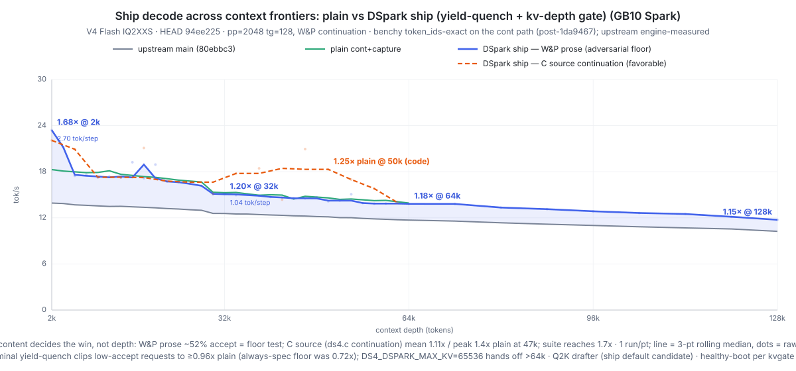
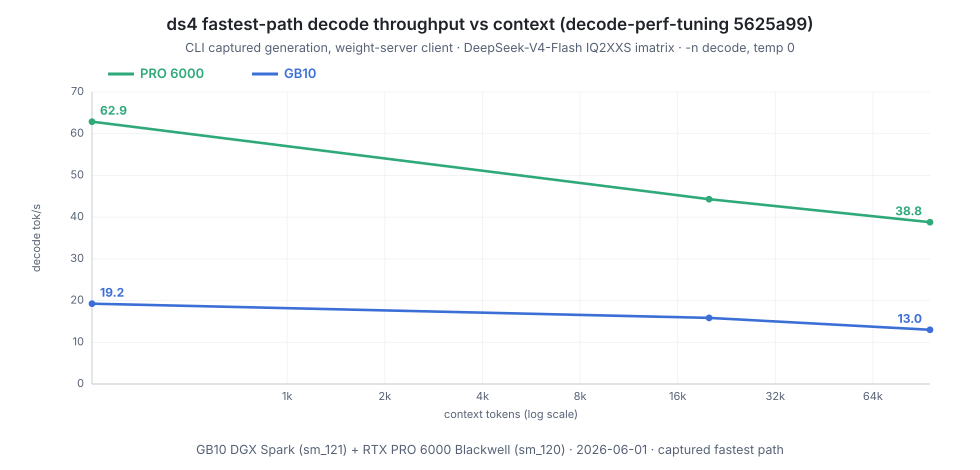
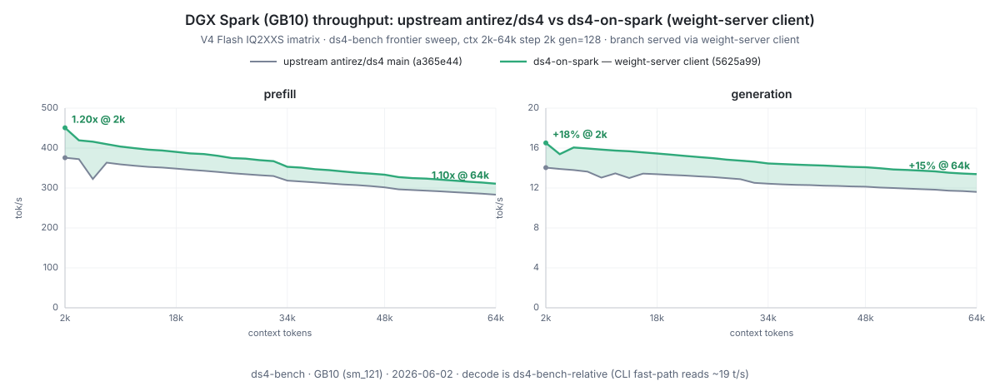

# ds4-on-spark

This repo gets **[`Entrpi/ds4`](https://github.com/Entrpi/ds4)** — our
DGX-Spark-optimized, major-feature fork of
[`antirez/ds4`](https://github.com/antirez/ds4) (DwarfStar 4) — running on
your Spark with one command, serving **DeepSeek-V4-Flash** entirely on-device
(GB10 / SM121, 128 GB unified memory — ~119 GiB usable; RTX PRO 6000 /
5090-class `sm_120` also builds).

Compared to the upstream engine you get **double or more the prefill
throughput** (2× on GB10, ~4× on a PRO 6000), **1.15–1.7× the decode speed
across the full 2k–128k context range**, and a rich serving experience
upstream doesn't have: **continuous batching**, **prefix caching** (warm
start cuts time-to-first-token ~7× on shared prefixes, with fork-by-copy
fan-out for parallel branches), and **DSpark lossless speculative decode** —
together, a much faster multi-agent experience than single-stream serving.
The [fork delta table](#what-the-fork-adds-over-upstream) itemizes exactly
what changed and how each claim was measured; benchmarks, the roofline
model, and the engineering story follow below. Upstream remains the
architectural foundation and the model recipe — this repo pins and packages
the fork.

**Status:** Working end-to-end, pinned to the fork release
[**`v0.1.1`**](https://github.com/Entrpi/ds4/blob/v0.1.1/CHANGELOG.md). On real
workloads, **DSpark lossless speculative decode reaches a suite mean of ~28 t/s
on GB10** — **1.38× plain continuous decode** (peak 1.71× on stepwise math at
89 % draft acceptance) — and since v0.1.1 it is **net-positive by default**: a
terminal yield-quench controller turns speculation off per request when
realized acceptance can't pay the verify cost, so the worst case is **~0.96×
plain on adversarial prose** where always-on speculation used to bottom out at
0.72×, and a kv-depth gate hands off to plain decode past 64k context.
Speculative gain is content-dependent (structured / code / math wins big,
open-ended prose sits at parity) — see the
[two-corpus frontier chart](docs/v011_decode_overlay.svg) and the
[break-even law](#the-break-even-law) below. Prefill runs ~2× the upstream
engine on GB10 (D2R tensor-core MoE GEMMs). The Metal backend is unaffected.

- **Reference:** [`antirez/ds4`](https://github.com/antirez/ds4) — MIT-licensed C+CUDA inference engine (CUDA backend landed 2026-05-11; the architecture writeup below uses HEAD `920f987`). **This repo pins the [`Entrpi/ds4`](https://github.com/Entrpi/ds4) fork at release [`v0.1.1`](https://github.com/Entrpi/ds4/blob/v0.1.1/CHANGELOG.md)** (2026-07-13): the batched-serving line — D2R tensor-core prefill, per-layer CUDA-graph decode capture, continuous batching, weight server, DSpark speculative decode with terminal yield quench (default on) + kv-depth gate. The fork `CHANGELOG.md` documents every fork-side change; older sections of this README that analyze May/June snapshots are marked as historical where superseded.
- **Model:** [`antirez/deepseek-v4-gguf`](https://huggingface.co/antirez/deepseek-v4-gguf) — 81 GiB asymmetric quant: IQ2_XXS for routed-expert gate/up, Q2_K for routed-expert down (these dominate model bytes), Q8_0 for everything else dense (shared expert, attention projections, output head, router), F16 for LoRA matrices and the compressor/indexer, F32 norms. (FP8 in ds4 is a *runtime* KV-cache quantization — E4M3FN round-trip — not a stored weight format.) Plus an optional 3.6 GiB MTP draft GGUF.
- **Hardware:** NVIDIA DGX Spark, GB10, SM121, 128 GB LPDDR5X unified (~119 GiB usable). The donor's `Makefile` has a `make cuda-spark` target that builds native `sm_121`, plus `make cuda CUDA_ARCH=sm_NNN` for an explicit override — both GB10-correct with no patches needed. (Building with an empty `-arch` measured ~25% slower prefill on GB10, so the explicit arch matters.)

## What the fork adds over upstream

[`Entrpi/ds4`](https://github.com/Entrpi/ds4) tracks upstream and specializes
it for **Blackwell CUDA serving performance**. Everything below is fork-side
work, measured engine-to-engine against upstream `main` on the same GB10, same
GGUF (upstream decode measured flat May → July 2026):

| Area | Fork | vs upstream |
|---|---|---|
| **Prefill** | D2R ("dequant-to-register") tensor-core MoE GEMMs — IQ2_XXS / Q2_K / Q8_0 expert weights dequantized directly into MMA fragments from weight-server SoA artifacts; token-tile HMMA attention; L2-reuse-aware expert-major CTA schedule | **~2× on GB10** (305 → 800 tok/s @12k over the fork's own arc; ~4× on RTX PRO 6000, `sm_120`) |
| **Decode** | Per-layer CUDA-graph capture of the batched decode step; split-K/vectorized F16 decode matmul; aligned-quant dispatch tiers | **1.15–1.68× across 2k–128k context** ([chart](docs/v011_decode_overlay.svg)) |
| **Speculation** | DSpark lossless block drafter (3-layer target-fused, Q2K) + terminal yield-quench (net-positive per request, default on) + kv-depth gate | upstream MTP is single-token, net-negative single-stream; fork suite mean **1.38×** its own plain decode |
| **Serving** | Continuous batching (mid-flight admit/evict, chunked prefill interleave), per-bank warm start (~7× TTFT on shared prefixes), fork-by-copy fanout, OpenAI + Anthropic-shape APIs | upstream serves one stream |
| **Ops** | Resident weight server (VMM-backed, IPC manifest) — engines import the 81 GiB model in seconds instead of multi-minute reloads; builds the aligned repack artifacts the fast kernels read in place | upstream reloads per process |
| **Telemetry** | Per-step speculative trace + offline policy replayer (`tools/dspark_trace_replay.py`), quench/gate/profile counters | — |

Every fork-side change is documented in the fork
[`CHANGELOG.md`](https://github.com/Entrpi/ds4/blob/v0.1.1/CHANGELOG.md);
the engine internals writeup further down this page (roofline, bandwidth
model, CUDA backend architecture) applies to both.

## Quick start

On a DGX Spark with CUDA 13 installed:

```bash
curl -sSL https://raw.githubusercontent.com/entrpi/ds4-on-spark/main/install.sh | bash -s -- --start
```

That one command:

1. Verifies the host (aarch64, GB10/SM121, CUDA 13, ≥120 GiB free disk).
2. Clones the `Entrpi/ds4` fork at tag **`v0.1.1`** into `~/code/ds4` (or `$DS4_SRC_DIR`).
3. Builds `ds4`, `ds4-server`, `ds4-bench` with `CUDA_ARCH=sm_121` in ~8 s.
4. Downloads the Q2 GGUF (~81 GiB) + MTP GGUF (~3.6 GiB) from
   [`antirez/deepseek-v4-gguf`](https://huggingface.co/antirez/deepseek-v4-gguf)
   and the DSpark Q2K drafter (~6.5 GiB) from
   [`bleysg/DeepSeek-V4-Flash-DSpark-drafter-GGUF`](https://huggingface.co/bleysg/DeepSeek-V4-Flash-DSpark-drafter-GGUF)
   into `~/gguf` (or `$DS4_GGUF_DIR`).
5. Runs the "capital of France" smoke test and asserts "Paris" in the output.
6. Starts `ds4-server` on `:8000` with `-c 32768` serving the **full DSpark
   speculative stack** — lossless, suite mean **1.38× plain decode**, with the
   yield-quench controller and kv-depth gate riding the v0.1.1 defaults.

`--no-dspark` serves plain continuous decode instead (skips the drafter
download); `--with-mtp` alone gives MTP-2 speculation (a modest ~1.08×).

To preview without running:

```bash
curl -sSL https://raw.githubusercontent.com/entrpi/ds4-on-spark/main/install.sh | bash -s -- --help
```

Common overrides: `--cuda-arch sm_120` (RTX PRO 6000 / 5090-class Blackwell; datacenter B200/B300 is `sm_100`, untested), `--no-download`
(reuse existing GGUF), `--src-dir`, `--gguf-dir`, `--ctx`, `--port`, `--force`
(skip host check).

## Upgrading from an earlier install

Re-run the installer — every step is idempotent:

```bash
pkill -x ds4-server   # the installer starts servers but never stops old ones
curl -sSL https://raw.githubusercontent.com/entrpi/ds4-on-spark/main/install.sh | bash -s -- --start
```

What happens to an existing setup:

- **Your ds4 clone fast-forwards to the `v0.1.1` tag** (`git fetch` +
  `reset --hard`, remote repointed automatically if you installed back when
  this repo cloned `antirez/ds4`). Any local edits in that clone are
  **discarded** — it's an installer-managed tree.
- **GGUFs you already have are kept** (size-checked, not re-downloaded). Two
  new downloads happen on upgrade: the DSpark drafter (~6.5 GiB) and — if you
  installed before 2026-07-13 — the **imatrix base quant** (~81 GiB): the old
  installer default pointed at the plain `chat-v2.gguf` while the quality
  baselines were all measured on `chat-v2-imatrix.gguf`; the default now
  matches the validated build. To keep serving your existing non-imatrix
  file instead (and skip the 81 GiB):
  `GGUF_FILE=DeepSeek-V4-Flash-IQ2XXS-w2Q2K-AProjQ8-SExpQ8-OutQ8-chat-v2.gguf ./install.sh --start`
- **The default serve mode changes** from plain decode to the DSpark
  speculative stack (same OpenAI-compatible API, lossless output, ~10 GiB
  more unified memory in use). `--no-dspark` restores the old behaviour.
- If a rebuild ever looks wrong after a big jump, `make -C ~/code/ds4 clean`
  and re-run.

## Hardware requirements

| | |
|---|---|
| Validated on | NVIDIA DGX Spark (GB10, SM121, 128 GB / ~119 GiB unified) |
| Likely to work | RTX PRO 6000 / 5090-class Blackwell with `--cuda-arch sm_120` (PRO 6000 prefill measured); `sm_100` datacenter untested |
| CUDA toolkit | 13.x (we tested 13.0.88) |
| Disk | ≥110 GiB free for the GGUFs |
| OS | aarch64 Linux (Grace) |
| RAM (system, unified) | 128 GB (~119 GiB usable) is enough for the model + ~250 MB KV @ 16k context |

GB10 is detected via `nvidia-smi --query-gpu=compute_cap` returning `12.1`.
Anything else gets a warning + `--force` override path.

## What you get

| Binary | Purpose |
|---|---|
| `ds4` | Interactive / one-shot CLI |
| `ds4-server` | OpenAI v1-compatible HTTP server (`POST /v1/chat/completions`, SSE streaming) |
| `ds4-bench` | Direct prefill + decode throughput sweep (no HTTP) |

`ds4-server` is the recommended runtime. It exposes:

- `POST /v1/chat/completions` (OpenAI-compatible streaming, tool calls)
- `POST /v1/completions`
- `GET /v1/models`

It also speaks Anthropic-shape on `/v1/messages` (see donor README).

## DSpark: the featured serving mode

Since fork `v0.1.1`, the featured runtime is **continuous batching + DSpark
lossless speculative decode** (a DFlash-style drafter verified by the target
model — the verify forward is the sole token source, so output is lossless by
construction; quality held at gsm8k 97.5 % / mbpp 92.5 % through the full
serving path at the release gate).

Measured on GB10 with llama-benchy's `mtp-bench` suite (9 workloads × 3 runs,
512 tokens, non-streaming wall tok/s):

| workload | plain t/s | DSpark t/s | gain | tok/step | accept |
|---|---|---|---|---|---|
| stepwise_math | 20.1 | 34.5 | **1.71×** | 4.00 | 89 % |
| qa_factual | 19.6 | 31.9 | 1.63× | 3.89 | 91 % |
| summarize | 19.6 | 31.0 | 1.59× | 3.88 | 87 % |
| code_cpp | 20.4 | 30.0 | 1.47× | 3.38 | 80 % |
| translation | 20.4 | 27.9 | 1.37× | 3.10 | 76 % |
| code_python | 20.5 | 26.4 | 1.29× | 2.94 | 72 % |
| explain_concept | 20.5 | 25.2 | 1.23× | 2.80 | 69 % |
| long_code_review | 18.8 | 22.1 | 1.17× | 2.62 | 66 % |
| creative_short | 20.6 | 19.9 | 0.96× | 2.18 | 58 % |
| **suite mean** | **20.1** | **27.7** | **1.38×** | — | — |

<sub>Stamped 2026-07-11 at the v0.1.0 release cut (Q4K drafter, `-c 4096`,
non-streaming `usage`-counted wall tok/s). The Q2K drafter — the v0.1.1
default — measured equal-or-better in a same-script A/B (suite mean 28.8 vs
28.3, acceptance within ±3 pp per workload).</sub>



The chart is the honest version of the same story across context depth: the
solid line is **War & Peace continuation** — deliberately the hardest corpus
(~52 % acceptance, at break-even) — and the dashed line is **C-source
continuation** (mean 1.11×, raw peak 1.42× over plain at 47k). Content decides
the win; two safety nets bound the losses:

- a **terminal yield-quench controller** (default on) that turns speculation
  off for the rest of any request whose realized acceptance can't pay its
  verify cost — worst case ~0.96× plain, versus 0.72× for always-on
  speculation on the same corpus;
- a **kv-depth gate** (`DS4_DSPARK_MAX_KV=65536`) that hands deep-context
  requests to plain decode, which stays 1.15–1.2× the upstream engine out to
  128k.

### The break-even law

One DSpark verify step (1 committed row + 4 draft rows through the full
model) costs a depth-flat **~2.17 plain decode steps** on GB10. So

```
speedup = tokens-per-step ÷ 2.17        break-even ≈ 56 % draft acceptance
```

Everything above follows from this: structured content accepts 70–90 % of
drafts (1.3–1.7×), open-ended prose sits near 52 % (parity), and the quench
controller is just this law enforced per request — it accumulates the
cumulative regret `2.22 − tokens-per-step` each verify step and terminally
quenches the request when the deficit exceeds ~4 plain-step times. The
parameters were calibrated offline against per-step traces
(`DS4_DSPARK_TRACE=1` + `tools/dspark_trace_replay.py` in the fork) and the
in-engine controller is validated to reproduce the offline policy exactly.

### The drafter artifact

The installer downloads the prebuilt ~6.5 GiB Q2K drafter from
[`bleysg/DeepSeek-V4-Flash-DSpark-drafter-GGUF`](https://huggingface.co/bleysg/DeepSeek-V4-Flash-DSpark-drafter-GGUF)
by default. Q2K routed experts are the ship default (equal throughput and
acceptance to Q4K in A/B, 4.2 GiB smaller). To build a drafter yourself from
the official checkpoint's drafter shards (e.g. the Q4K-expert variant), use
the fork's extraction tool:

```bash
cd ~/code/ds4
python3 gguf-tools/dspark_extract.py --src <dir-with-drafter-shards> \
    --out ~/gguf/DSpark-drafter-Q4K-Q8.gguf --validate --experts q4_k
```

Kill switches if you ever need them: `DS4_DSPARK_QUENCH=0` (always-spec below
the kv gate), `--no-dspark` at install / `DS4_CONT_DSPARK` unset (no DSpark).

## Benchmarks

Hardware: a single DGX Spark — GB10, `sm_121`, `compute_cap=12.1`, CUDA 13.0.88.

*(The serving-facing v0.1.1 numbers — DSpark suite table and the two-corpus
context frontier — live in the [DSpark section](#dspark-the-featured-serving-mode)
above. This section is the single-stream engine deep-dive: the roofline model
and the June measurement campaign it was built on. The plain-decode picture it
paints still holds at v0.1.1 — plain continuous decode measures 18–20 t/s at
short context on the same box.)*

Numbers here come from two instruments, kept distinct on purpose. The
**fastest-path decode** figures (next) are the `decode-perf-tuning`
branch (`5625a99`, 2026-06-01), measured the way ds4 actually decodes — captured
CUDA-graph generation via the CLI, as a weight-server client. The `ds4-bench`
frontier-sweep tables further below are the earlier `1c4c5f0` (2026-05-21)
snapshot (mmq Q8_0 dispatch + in-process VMM weight arena + per-layer CUDA-graph
decode capture). Note `ds4-bench`'s per-frontier `gen_tps` **under-reads** the
captured fast path, so treat its decode column as a conservative floor.
Build/cold-start + `llama-benchy` HTTP numbers are from the `920f987`
(2026-05-12) snapshot.

### Fastest-path decode <sub>(`decode-perf-tuning` `5625a99`, captured CLI)</sub>



Captured generation (`DS4_CUDA_LAYER_GRAPHS=1`, `--temp 0`), weight-server client,
DeepSeek-V4-Flash IQ2XXS imatrix:

| context | GB10 (sm_121) | RTX PRO 6000 (sm_120) |
|---:|---:|---:|
| short (≤0.5k) | **19.24 t/s** | **62.88 t/s** |
| ~20k | 15.85 | 44.29 |
| ~96k | 12.99 | 38.79 |

- Decode tapers with context — the lightning indexer scores the growing
  compressed KV before its top-512 cap — but stays above the prior snapshot and
  upstream at every depth.
- The gain over the `1c4c5f0` snapshot is the **split-K + vectorized F16 matmul**
  (now the decode default) plus the PRO-6000 flash-decode attention split:
  **+10 % GB10 / +22.6 % PRO 6000** on the captured path.
- **Prefill is unchanged** on this branch (still mmq + VMM) — via the
  weight-server client it lands **~1.2× GB10 / ~4.9× PRO 6000** over upstream
  (GB10 shown below; the in-process direct-load path reads a touch higher on
  PRO, ~5.9×).

### Uplift vs. upstream <sub>(`5625a99` weight-server client, `ds4-bench`)</sub>



Same model, same prompt corpus, both sides built at `sm_121` and benched on the
same GB10 on 2026-06-02, the branch served as a **weight-server client** (the
shipped fast path). The branch (mmq Q8_0 dispatch + VMM weight arena + per-layer
CUDA-graph decode capture) is **1.20× → 1.10× faster prefill** and **+18% → +15%
faster decode** than upstream `antirez/ds4` (`a365e44`) across the full 2k–64k
context sweep. (Decode here is the `ds4-bench`-relative figure — the captured CLI
fast path reads higher, ~19 t/s; the relative gain over upstream is what this
panel shows.)

### Build + cold start <sub>(`920f987` snapshot — pre-CUDA-graph)</sub>

| Step | Time |
|---|---|
| `make -j20 CUDA_ARCH=sm_121` | **7.9 s** |
| Cold load: 80.76 GiB of tensors → GPU cache | **~20 s** |
| Time-to-first-token (cold process, 12-token prompt) | **~21 s** |

After cold start, all subsequent benchmarks here are on a warm process.

### Throughput sweep (`ds4-bench`, direct CLI, no HTTP)

`ds4` at `1c4c5f0`, imatrix Q2 GGUF, `--gen-tokens 128`, layer-graph decode
capture on (default). Prefill is measured on a fixed 2,048-token chunk and is
prompt-sensitive, so the corpus is named: `rendered_prompts_nothink.txt`.
ctx 2k–64k:

| ctx | prefill t/s | decode t/s | KV size |
|---:|---:|---:|---:|
| 2,048 | 458.3 | 15.37 | 52 MB |
| 8,192 | 407.2 | 15.24 | 137 MB |
| 16,384 | 392.5 | 14.99 | 250 MB |
| 24,576 | 379.5 | 14.64 | 362 MB |
| 32,768 | 367.8 | 14.11 | 475 MB |
| 40,960 | 344.7 | 13.86 | 588 MB |
| 49,152 | 333.6 | 13.66 | 701 MB |
| 57,344 | 322.0 | 13.33 | 813 MB |
| 65,536 | 312.2 | 13.00 | 926 MB |

- Prefill **~310–460 t/s** across 2k → 64k, tapering smoothly with context.
- Decode **~13–15 t/s**, ~15 % falloff from 2k to 64k.
- Per-layer CUDA-graph decode capture (on by default) contributes **+5 → +10 %**
  of the decode rate vs. the eager path, the gain widening with context.
- KV stays compact — 926 MB at 64k — compressed KV doing its job.

### `llama-benchy`-style numbers (HTTP)

Refreshed 2026-05-21 against `ds4` at `1c4c5f0`, imatrix Q2 GGUF, via
[`eugr/llama-benchy`](https://github.com/eugr/llama-benchy) `0.3.8` through
`ds4-server`'s OpenAI endpoint — `--pp 2048 --tg 32 128 512 --depth 0 4096 16384`,
3 runs each. This `llama-benchy` release reports `tg` as a near end-to-end
decode rate, so the HTTP figures below line up with the direct-CLI decode
sweep above (~15 t/s); earlier releases printed a steady-state-only `tg`
roughly 2× higher.

| test | t/s | peak t/s | ttfr (ms) |
|---|---:|---:|---:|
| pp2048 (prefill) | **449.1** | — | 4791 |
| tg32 @ d=0 | 16.76 ± 0.26 | 18.0 | — |
| tg128 @ d=0 | 15.69 ± 0.03 | 18.7 | — |
| tg512 @ d=0 | 15.47 ± 0.01 | 18.3 | — |
| pp2048 @ d=4k | 416.4 | — | 15387 |
| tg32 @ d=4k | 19.75 ± 2.66 | 21.8 | — |
| tg128 @ d=4k | 15.52 ± 0.08 | 18.3 | — |
| tg512 @ d=4k | 15.35 ± 0.05 | 18.0 | — |
| pp2048 @ d=16k | 401.8 | — | 47505 |
| tg32 @ d=16k | 16.42 ± 0.49 | 17.0 | — |
| tg128 @ d=16k | 15.31 ± 0.34 | 17.3 | — |
| tg512 @ d=16k | 14.95 ± 0.02 | 18.0 | — |

Prefill holds **~400–450 t/s** and decode **~15–16 t/s** across 0–16k depth,
consistent with the direct-CLI sweep. (`tg32` is the noisiest row — only 32
tokens, so first-token setup still skews its mean and variance.)

Reproduce:

```bash
scripts/run-bench.sh --pp 2048 --tg 32 128 512 --depth 0 4096 16384
```

## Roofline analysis

How far below the hardware ceiling is ds4 running?

### Memory bandwidth ceiling (measured on Spark)

| Probe | Bandwidth | Note |
|---|---:|---|
| `nvbandwidth` H2D / D2H CE | 59 GB/s | Copy-engine path, not relevant for kernels |
| `nvbandwidth` device_local_copy | 111 GB/s | CE on single device |
| `bench/bw_bench.cu` copy (R+W) | **215 GB/s** | Kernel-driven, what matters |
| `bench/bw_bench.cu` read-only | **227 GB/s** | Pure read throughput |
| Published GB10 LPDDR5X peak | ~273 GB/s | 256-bit × 9400 MT/s theoretical |

The kernel-effective ~225 GB/s is the relevant ceiling — ~82 % of theoretical
peak, normal for real workloads on LPDDR.

### Bytes per token at decode (from safetensors index)

Aggregated across all 17 shards (88.4 GB total):

| Bucket | Total bytes | Active per token |
|---|---:|---|
| Routed experts (IQ2_XXS + Q2_K) | 78.28 GB | 6/256 active → **1.83 GB** |
| MLA attention + indexer + compressor | 7.05 GB | **all active** |
| Embed / head / final norm | 2.12 GB | **~1.0 GB** (head projection) |
| Shared expert (1 per MoE layer) | 0.74 GB | **0.74 GB** |
| MTP + HC + other | 0.30 GB | **~0.22 GB** |
| KV cache reads (at 16k) | — | **~0.25 GB** |

**Effective bytes per token at steady state: ~11 GB** — the sum of the
Active-per-token column, derived bottom-up from the model index, independent
of any timing measurement.

### Roofline

Bytes/token is the bottom-up figure above; the decode rate is measured. The
two are independent — not cross-derived. (An earlier draft computed one from
the other and reported the circular result as "95 % saturated".)

| Quantity | Value |
|---|---:|
| Kernel-effective bandwidth | 225 GB/s |
| Effective bytes per token (bottom-up) | ~11 GB |
| Bandwidth roofline (BW ÷ bytes-per-token) | 225 / 11 ≈ **20.5 t/s** |
| Fastest-path decode, short ctx (`5625a99`, captured CLI) | **19.24 t/s** |
| Decode efficiency | **~94 % of the bandwidth roofline** |

**Fastest-path decode now runs at ~94 % of the bandwidth roofline** — 19.24 t/s
against the ~20.5 t/s ceiling, up from ~73 % (~15 t/s) on the pre-tuning
snapshot. The split-K + vectorized F16 decode matmul and per-layer CUDA-graph
capture (see Benchmarks) reclaimed most of the launch-overhead and
kernel-occupancy gap that used to sit between decode and the bandwidth wall; at
short context decode is now essentially bandwidth-bound. It still tapers with
context — the lightning indexer scans the growing compressed KV before its
top-512 cap — but that is attention work, not the weight-bandwidth wall this
roofline measures.

Beyond the roofline itself, going faster needs a tighter quant (FP4 / 1.5-bit
experts) or batched serving (amortise weight reads across users).

The bytes-per-token figure is a bottom-up estimate; ±20 % on it swings the
efficiency to roughly ~78 % up to saturation. The qualitative result — decode is
now close to the bandwidth wall at short context — holds across that range.

## Under the hood: how the CUDA backend works

A side-by-side analysis of ds4's two GPU backends —
[**docs/METAL_VS_CUDA.md**](docs/METAL_VS_CUDA.md) — covers the kernel
surface, the command lifecycle, and the model-attach strategy on each
platform. TL;DR for someone running on Spark and asking *what is the
implementation actually doing?*:

- **`ds4_cuda.cu` is 9,666 LOC, 106 `__global__` kernels, links `-lcudart -lcublas`.**
  All compiled ahead of time by `nvcc` for the target `CUDA_ARCH` — the binary
  is not portable across SM generations.
- **Three-tier model attach.** `cudaHostRegister(... cudaHostRegisterMapped | ReadOnly)`
  on the mmap'd 80 GiB GGUF is tried first to get a zero-copy device pointer.
  If pinning fails (or `DS4_CUDA_COPY_MODEL` is set), the engine falls back to
  per-range pinning, then to chunked `cudaMalloc + cudaMemcpy` in 64 MiB chunks.
  This is what the ~20 s cold load is.
- **Q8 → F16 weight cache for prefill.** On startup, dense Q8_0 weights are
  dequantised once on-device into an F16 buffer; `cublasGemmEx` then uses
  tensor cores for multi-token prefill matmuls. That's why prefill is
  ~310–460 t/s while decode is ~15 t/s — they take different routes through
  the matmul stack. Decode (`n_tok=1`) skips cuBLAS and uses hand-written
  Q8_0 matvecs where the cuBLAS launch overhead wouldn't amortize.
- **Routed experts stay quantised.** IQ2_XXS / Q2_K kernels dequantise inline
  on every expert dot; the codebook lives in `__constant__` memory via
  `ds4_iq2_tables_cuda.inc`. Pre-converting all 256 experts to F16 would erase
  the q2 memory win.
- **Default stream, serial execution.** `begin_commands` is a no-op;
  `flush_commands`, `end_commands`, and `synchronize` all reduce to
  `cudaDeviceSynchronize()`. Two named streams (`g_model_prefetch_stream`,
  `g_model_upload_stream`) exist only for async model staging at startup.
  Combined with the engine's single-session worker thread, this is why
  `ds4-server` serialises concurrent clients (see next section).
- **No GDS / cuFile.** Direct file reads (via `ds4_gpu_set_model_fd`) use Linux
  `O_DIRECT` on a registered FD — kernel DMA, not GPU-side DMA.

If you're considering writing a port, fork, or alternative serving layer,
the analysis doc lays out the kernel surface, the `DS4_CUDA_*` env-var knobs,
and the places where the Metal and CUDA backends diverge structurally
(model mapping, command-buffer batching, library use).

## Concurrency on `ds4-server` — continuous batching since v0.1.x

*(Historical note: through the May/June snapshots this section documented the
server as single-stream/serialized. That is no longer true.)*

Since the fork's batched-serving line (v0.1.0+), `ds4-server` runs
**continuous batching by default**: concurrent requests are admitted
mid-flight into per-sequence KV banks, prefill is chunked and interleaved
with live decode, and the multi-sequence forward scales ~6× from batch 1 to
128 in the engine. Per-bank warm start and fork-by-copy give large TTFT wins
on shared-prefix fan-out. `DS4_SERVER_CONTINUOUS=0` restores the old
serialized behaviour; for single-user latency-critical use that can still
be the right call. DSpark speculation engages on solo streams (the default
`DS4_DSPARK_MAX_NLIVE=1` regime) and hands concurrent traffic to plain
batched decode, which wins above N=1 today.

## MTP (speculative decode) — the June analysis, and how it resolved

> **Postscript (2026-07-13):** this section's closing prediction — *"the path
> to a real win is batched serving, not a cleverer single-stream verifier"* —
> is exactly what happened. The fork's batched-serving line rebuilt
> speculation on top of continuous batching (MTP-2 mode: 1.08× suite), then
> replaced the single-token MTP head with the DSpark block drafter (1.38×
> suite mean, up to 1.71×), and v0.1.1 made it net-positive per request with
> the yield-quench controller. See
> [DSpark: the featured serving mode](#dspark-the-featured-serving-mode).
> The analysis below is kept as the honest record of why single-stream
> prefill-verify MTP lost on this hardware.

The donor ships `--mtp <draft.gguf> --mtp-draft N`, using a separate 3.6 GiB
draft GGUF (`DeepSeek-V4-Flash-MTP-Q4K-Q8_0-F32.gguf`). The donor README
labels MTP "alpha quality / experimental."

**Status on this branch (`5625a99`):** MTP now works on CUDA and is
**bit-exact to non-MTP greedy decode** — but it is a **net throughput loss
on single-stream decode**, so we leave it off and feature no-MTP numbers.
Both of those changed since the earlier writeup, which said the draft kernel
"never produces a token" and projected a large speedup once a Q4_K MoE kernel
landed. Neither holds anymore; here is the corrected picture. The full
analysis is in [`docs/MTP_PARITY_GAP.md`](docs/MTP_PARITY_GAP.md).

**The Q4_K draft-kernel gap is closed.** The earlier blocker was real:
`routed_moe_launch` in `ds4_cuda.cu` hard-rejected anything but
`gate_type == IQ2_XXS && down_type == Q2_K`, and the MTP block's routed
experts are Q4_K — so every draft attempt failed inside the MoE launcher and
the speculative state machine fell back to one token per cycle. A Q4_K MoE
path has since been added (the reject now only fires for genuinely
unsupported quant combinations), so MTP produces drafts. The old repro that
counted 58 draft-kernel failures now counts zero:

```bash
DS4_MTP_PROBE=1 ./ds4 --cuda -m … --mtp … --mtp-draft 2 --temp 0 --nothink \
  -p "List 20 prime numbers" 2>&1 | grep -c "mtp probe draft failed"
# 0   (was 58 — every draft now produces a token)
```

**The verifier is bit-exact.** At `5625a99` the exact verifier runs the same
mmq kernels as the base decode path and defaults to a sequential 2-row
verify, so MTP output is byte-identical to non-MTP greedy in both eager and
CUDA-graph-captured mode, on both sm_120 and sm_121. The no-MTP determinism
goldens are unchanged (GB10 long-context `b165ddd4`, PRO 6000 opp-c golden).

**Why it's still a loss — performance, not correctness.** The exact 2-row
verifier sweeps the weight-bound projections (Q/KV, attn-out, routed MoE)
**once per draft row** instead of sharing one sweep, so verifying 2 tokens
costs ~2× a single decode (~105 ms vs ~52 ms on GB10; ~34 vs ~16 ms on
PRO 6000 — the 2× ratio is architecture-independent). The MTP head's
acceptance saturates at ~1.4 suffix tokens on prose / ~2.0 on numeric lists,
so the cycle does ~2× the work for well under 2× the tokens. Measured A/B
(weight-server client, draft=2, temp 0, CUDA-graph-captured, accept-gate
forced off):

| Workload | no-MTP t/s | MTP (seq verify) t/s | Δ |
|---|---:|---:|---:|
| Prose (n=128) | 19.64 | 15.58 | **−21 %** |
| Numeric lists (n=200) | 19.52 | 16.51 | −15 % |

Even at 100 % acceptance MTP loses: 172 ms / 3 tokens = 57 ms/tok vs
51 ms/tok for plain decode. In production the accept-gate auto-disables MTP
when draft confidence is low (most prose), so with default flags it reads as
a wash rather than a loss — but there is no single-stream win to capture here,
so the featured benchmarks are no-MTP.

**This is not the model's fault — perf-positive MTP on DeepSeek-V4-Flash is
real.** vLLM runs MTP on this exact model in production
([vLLM #43447](https://github.com/vllm-project/vllm/pull/43447) comment
benchmarks): mean acceptance length 1.80–1.86, per-position accept 0.80–0.86,
draft depth K=3, with accepted throughput that grows with batch size
(+30.9 % at BS=1 rising to +88.4 % at BS=4). The difference is structural.
vLLM does **one batched K-position verify** — a single weight sweep across
the whole draft block, "lossless" (a valid greedy decode of the target) but
*not* bit-identical to the single-token path — and amortizes that sweep
across a **request batch**. ds4's single-stream (BS=1), per-row,
bit-identical verify gets neither axis: it pays ~2 weight sweeps for ~1.6
accepted tokens.

### The path to a real win is batched serving, not a cleverer single-stream verifier

We prototyped the obvious fix — a weight-shared exact verifier that batches
the per-row-independent projections into one sweep. It is bit-exact, but on
single-stream it is perf-neutral-to-negative:

- the routed MoE batches to **zero** gain — the two draft rows route to
  disjoint experts, so a "shared" sweep just reads the union of both rows'
  experts (no bandwidth saved);
- attn-out is too small a weight (low-rank) for sharing it to matter;
- the sequential verifier's early-stop on partial accepts beats an
  always-both-rows interleave.

The real lever is cross-request amortization plus a lossless K-position
verify over the multi-token prefill path (which already runs one weight
sweep for many tokens) — i.e. the batched-serving work, tracked separately.
**Bottom line for single-stream Spark today: leave MTP off.**

## Quality checks (qualitative)

ds4 produces clean output on first try across several probe types:

**Factual recall** — "What is the capital of France?" → "The capital of France is Paris." ✓

**Code + reasoning** — "`is_prime(n)` with 6k±1 optimization, list primes 100-130" →

```python
def is_prime(n):
    if n <= 1: return False
    if n <= 3: return True
    if n % 2 == 0 or n % 3 == 0: return False
    i = 5
    while i * i <= n:
        if n % i == 0 or n % (i + 2) == 0:
            return False
        i += 6
    return True
```

Prime numbers listed: **101, 103, 107, 109, 113, 127** — all six correct.

**Long-form structured** — "Explain QuickSort with worked example [38, 27, 43,
3, 9, 82, 10], full recursion, complexity analysis, optimizations" — clean
multi-section response with correct partitioning steps and complexity bounds.

## Repo layout

```
install.sh                  One-shot installer (curl | bash | --help)
scripts/
  smoke-test.sh               First-token sanity check
  start-server.sh             Start ds4-server (idempotent, with-MTP flag)
  run-bench.sh                Run llama-benchy via uvx
bench/
  bw_bench.cu                 Kernel-side memory-bandwidth probe
docs/
  STRATEGIC_CHECKPOINT.md     Detailed analysis of how this benchmark
                              affects the "should we keep porting?" decision
  METAL_VS_CUDA.md            Side-by-side comparison of ds4_metal.m and
                              ds4_cuda.cu — kernel surface, command lifecycle,
                              model attach, quantisation, and where each
                              backend's design diverges
  MTP_PARITY_GAP.md           MTP status on CUDA: the Q4_K draft-kernel gap
                              is closed (5625a99) and MTP is bit-exact to
                              non-MTP; the remaining gap is single-stream
                              verify cost (verify ~2x a decode), which only
                              batched serving fixes — not a single-stream
                              kernel.
```

## Reproducing the benchmarks

```bash
# 1. Build + download + smoke test
./install.sh --with-mtp

# 2. Start the server
./scripts/start-server.sh --port 8000 --ctx 32768

# 3. Run llama-benchy (installs uvx automatically if you don't have it)
curl -LsSf https://astral.sh/uv/install.sh | sh   # one-time
./scripts/run-bench.sh                            # default sweep
./scripts/run-bench.sh --depth 0 4096 16384 32768 --tg 32 128 512

# 4. Measure raw memory bandwidth ceiling
/usr/local/cuda/bin/nvcc -O3 -arch=sm_121 bench/bw_bench.cu -o /tmp/bw_bench
/tmp/bw_bench 8192

# 5. Compare MTP vs no-MTP yourself
./scripts/start-server.sh --port 8000 --with-mtp --draft 2
./scripts/run-bench.sh --depth 0 --tg 128 --runs 3
```

## How this fits with related work

| Piece | Role |
|---|---|
| [`antirez/ds4`](https://github.com/antirez/ds4) | The C+CUDA inference engine itself — narrow, DSv4-Flash-only by design |
| [`antirez/deepseek-v4-gguf`](https://huggingface.co/antirez/deepseek-v4-gguf) | The Q2/Q4 GGUFs ds4 is designed to consume |
| this repo | Spark-specific install + benchmark + analysis layer on top of the donor |
| [`Entrpi/ds4-spark-vllm`](https://github.com/Entrpi/ds4-spark-vllm) | Alternative path: same model via vLLM. Different perf profile, more flexible serving, larger surface area. |
| [`eugr/llama-benchy`](https://github.com/eugr/llama-benchy) | The benchmark methodology used here — generic, OpenAI v1, comparable to llama-bench / vllm bench |

## Acknowledgements

- [`antirez/ds4`](https://github.com/antirez/ds4) — the inference engine and the 2-bit recipe. MIT-licensed.
- [`llama.cpp`](https://github.com/ggml-org/llama.cpp) and GGML — the GGUF ecosystem, quant formats, and engineering knowledge ds4 stands on.
- [`deepseek-ai`](https://huggingface.co/deepseek-ai) — DeepSeek-V4-Flash upstream weights and architecture.
- [`eugr/llama-benchy`](https://github.com/eugr/llama-benchy) — benchmark methodology and tooling.

## License

MIT.
